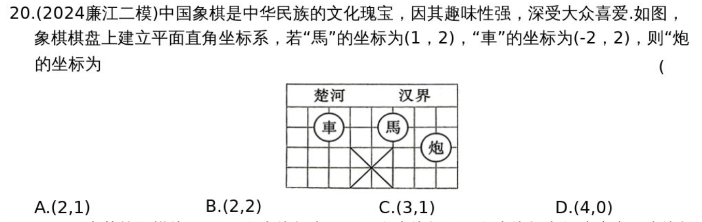
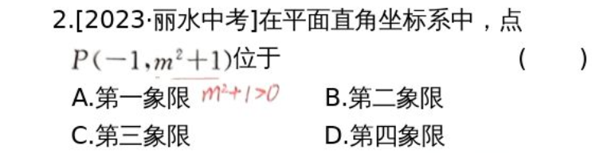
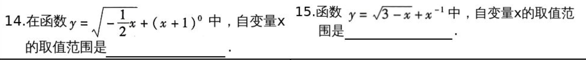
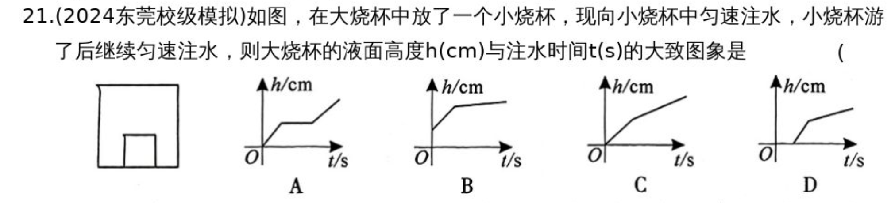

# 第10课上 平面直角坐标系
---
## 知识点
### 知识点1 坐标
   1. 定义：数轴上的点与实数是一一对应的，数轴上每一个点对于一个实数。这个实数叫做这个点在数轴上的坐标。
   
---
### 知识点3 平面直角坐标系
   1. 定义：在平面内画两条相互垂直、原点重合的数轴，组成平面直角坐标系。
   2. 水平的数轴称为x轴或横轴，习惯上取向右为正方向
   3. 垂直的数轴称为y轴或竖轴，习惯上取向上为正方向
   4. 两坐标系的交点O称为直角坐标系的原点
   5. 建立直角坐标系的一般步骤：
        1. 定原点，即根据条件，选择合适的点作为原点
        2. 作两轴，即国原点作相互垂直的x轴和y轴
        3. 定坐标系，即确定x轴和Y轴的正方向和单位长度

---
### 知识点3 点的坐标
   1. 定义：对于平面内任意一点A，由点A分别向x轴和y轴作垂线，垂足M在x轴上的坐标是a，垂足N在y轴的坐标是b，我们说点A的横坐标是a，纵坐标是b，有序数对(a,b)叫作点A的坐标，记作“A(a,b)”
   2. 几何意义：点A(x,y)到x轴的距离是|y|,到y轴的距离是|x|,到原点的距离是$\sqrt{(x^2+y^2)}$
   
---

### 知识点4 象限及其点坐标的特点
1.  坐标平面分成4个象限和两坐标轴
2.  x轴，y轴不属于任何象限
3. 具体点坐标正负性

| 第一象限 | 第二象限 | 第三象限 | 第四象限 | x轴     | y轴     |
| -------- | -------- | -------- | -------- | ------- | ------- |
| $(+,+)$  | $(-,+)$  | $(-,-)$  | $(+,-)$  | $(x,0)$ | $(0,y)$ |

---
### 知识点5 对称点的坐标
   1. $点P(x,y)关于x轴对称的点坐标(x,-y)$
   2. $点P(x,y)关于y轴对称的点坐标(-x,y)$
   3. $点P(x,y)关于原点对称的点坐标(-x,-y)$

---
### 知识点6 两点的距离
   任意两点$A(x_1,y_1),B(x_2,y_2)$之间的距离为$\sqrt{(x_1-x_2)^2+(y_1-y_2)^2}$：
   1. 点P(x,y)到原点的距离是$\sqrt{(x^2+y^2)}$
   2. 同一坐标轴上的两点之间的距离为$|x_1-x_2|(水平距离)或|y_1-y_2|(垂直距离)$
   3. 平行于坐标轴的直线上的两点之间的距离为$|x_1-x_2|$(水平距离)或$|y_1-y_2|$(垂直距离)
   4. 不同坐标轴上的两点A(x,0),B(0,y)之间的距离为$\sqrt{x_2+y_2}$

 ---  
### 知识点9 点的平移
   1. 点$P(x,y)$向右(或向左)平移a个单位长度，可得$P_右(x+a,y)(P_左(x-a,y))$
   2. 点$P(x,y)$向上(或向下)平移a个单位长度，可得$P_上(x,y+a)(P_下(x,y-a))$

---
## 考点
### 考点1 平面直角坐标系内点的特征

---

### 考点2 对称点及平移的坐标变化规律

---

## 考题

---

---

---
## 第10课下 函数及其图像
## 知识点
---
### 知识点1 常量与变量
   1. 在某一变化过程中，取值始终不变的量叫做常量
   2. 数值发生变化的量叫做变量
---

### 知识点2 函数
   设在一个变化过程中有两个变量x与y，如果对于x的每一个值，y都有唯一的值与它对应，那么就说x是自变量，y是x的函数。
   记住：
$$
y=f(x)
$$
其中：x：自变量，y：因变量，y随x的变化而变化

---
### 知识点3 自变量取值范围
   函数自变量的取值范围是指函数有意义的自变量的全体变量。确定自变量的取值范围时，不仅要考虑使函数关系式有意义，而且还要注意问题的实际问题

   |类型|举例|取值范围|
   |-|-|-|
   |整式型|$y=x+1$|全体实数|
   |分式型|$y=\frac{1}{x+1}$|分母不为0|
   |二次根式型|$y=\sqrt{x+1}$|被开方式大于或等于0|
   |分式+二次根式型|$y=\frac{a}{\sqrt{x+1}}$|被开方数大于或等于0且分母不为0|
   |负整数(零)指数幂型|$y=x^-1或y=x^0$|底数不为0|

---
### 知识点4 函数的表示方法
   |表示方法|定义|优点|不足|
   |-|-|-|-|
   |列表法|通过列出自变量的值与对应的函数值的表格来表示函数关系的方法|能明显地呈现出自变量的值与对应的函数值|只能列出部分自变量的值与对应的函数值，难以看出函数值随自自变量的变化而变化的规律|
   |图像法|用图像表示函数关系的方法叫做图像法|形象直观，能清晰地呈现函数的一些性质|所画的图像是近似的，局部的，从图像上观察的结果也是近似的|
   |解析式法|用关于自变量的数学式子表示函数与自变量的关系的方法叫做解析式法|简明扼要，规范准确，便于分析推导函数的性质|有些函数关系不能用解析式表示|

---

### 知识点5 函数图像
   1. 定义： 一般地，对于一个函数，如果把自变量与函数的每对对应值分别作为点的横坐标，纵坐标，那么坐标平面内右这些点组成的图形，就是这个函数的图象
   2. 判断点P(x,y)是否在函数图像上，将P(x,y)代入函数解析式，若满足函数解析式，则这个点在函数的图象上，否则不在函数的图象上。
   3. 函数图象上的点与其解析式的关系：函数图像上任意一点的横坐标和纵坐标一定是这个函数的自变量和函数值y的一对对应值；反之，一这一对应值为横、纵坐标的点必在函数图象上
   4. 描点法画函数图象的步骤：
      1. 列表--表中给出一些自变量的值及其对应的函数值
      2. 描点--在平面直角坐标系中，以自变量的值为横坐标，相应的函数值为纵坐标，描出表格中数值对应的点
      3. 连线--按照横坐标由小到大的顺序，把所描出的各点用平滑曲线连接起来

---

### 知识点6、初中常见的函数类型

| 类型       | 解析式        | 图像特点 | 说明                          |
| - | - | - | - |
| 一次函数   | $y=kx+b$     | 直线     | k：斜率 ,b:截距               |
| 反比例函数 | $y=k/x$      | 双曲线   | 在两象限内分布                |
| 二次函数   | $y=ax^2+bx+c$ | 抛物线   | $a>0 开口向上, a<0 开口向下$ |

---
### 知识点7 常见函数的图像与性质
1、一次函数 $y=kx+b$
- 图像：一条直线
- 斜率k：反映“变化快慢”
- 截距b：直线与y轴交点的纵坐标
- 性质：若k>0,函数递增；若k<0 ,函数递减

---
2、反比例函数 $y=\frac{k}{x}$
- 图像：两支双曲线
- 性质：
  - $k>0$:第一、三象限
  - $k<0:$第二、四象限
  - $|k|$越大，曲线离坐标轴越远

---
3、二次函数$y=ax^2+bx+c$
- 图像：抛物线
- 顶点：$\left(-\frac{b}{2a},\frac{4ac-b^2}{4a}\right)$	
- 对称轴：$y=-\frac{b}{2a}$
- 性质：
  - $a>0:$开口向上（最小值（顶点））
  - $a<0:$开口向下（最大值（定点））

---
### 知识点8  函数平移
#### 1、平移的基本概念
定义：平移是最基本的一种坐标变换，它的作用是把图形整体移动，不改变形状，大小和方向
#### 2、点平移变换
设原坐标为$(x,y)$平移后的坐标为$(x',y')$
若点向右平移a个单位，向上平移b个单位，则：

$$
\left\{
\begin{aligned}
x'=x+a \\
y'=y+b
\end{aligned}
\right.
$$

---
#### 3、点平移对应规律：右+左-，上+下-
| 变换方向  | 新坐标    | 说明      |
| --------- | --------- | --------- |
| 向右平移a | $(x+a,y)$ | 横坐标加a |
| 向左平移a | $(x-a,y)$ | 横坐标减a |
| 向上平移b | $(x,y+b)$ | 纵坐标加b |
| 向下平移b | $(x,y-b)$ | 纵坐标减b |

---
#### 4、函数平移变换
原函数 $y=f(x)$经过向右平移a个单位，向上平移b个单位后:
$$
y=f(x-a)+b
$$
#### 5、函数平移对应规律
| 变换方向  | 新函数表达式 | 说明      |
| --------- | ------------ | --------- |
| 向右平移a | $y=f(x-a)$   | 横坐标减a |
| 向左平移a | $y=f(x+a)$   | 横坐标加a |
| 向上平移b | $y=f(x)+b$   | 纵坐标加b |
| 向下平移b | $y=f(x)-b$   | 纵坐标减b |

口诀：括号内与x反着想，括号外与y同方向

---

##### 6、举例
| 原函数  | 动作 | 新函数 |
| ------- | ---- | ------ |
| $y=x^2$ | 向右平移2 | $y=(x-2)^2$ |
| $y=x^2$ | 向上平移3 | $y=x^2+3$ |
| $y=x^2$        | 同时向右平移2，向上3 | $y=(x-2)^2+3$ |
| $y=\sqrt{x}$ | 向左平移1 | $y=\sqrt{x+1}$ |
| $y=\sqrt{x}$ | 向下平移2 | $y=\sqrt{x}-2$ |
| $y=\|x\|$ | 向右3，向上1 | $y=\|x-3\|+1$ |

---

从点坐标出发：
由点坐标平移可以知道，如果$(x_0,y_0)$向右平移a个单位，向上平移b个单位，可以得到新坐标$(x_1,y_1)$,则

$$
\left\{
\begin{aligned}
x_1 &= x_0 + a, \\
y_1 &= y_0 + b
\end{aligned}
\right.
\;\Longrightarrow\;
\left\{
\begin{aligned}
x_0 &= x_1 - a, \\
y_0 &= y_1 - b
\end{aligned}
\right.
$$

又因为$(x_0,y_0)$在函数$y=f(x)$上，则
$$
y_0=f(x_0)
$$
把$x_0,y_0$用$x_1,y_1$表示则：
$$
y_1-b=f(x_1-a)
$$
把b移动到右边，然后新坐标函数为：
$$
y_1=f(x_1-a)+b
$$
新坐标$x_1,y_1$使用一般写法得到
$$
y=f(x-a)+b
$$
结论：将函数$y=f(x)$向右平移a个单位，向上平移b个单位后，得到的新函数为
$$y=f(x-a)+b$$

---
## 考点
### 考点1 自变量的取值范围

---
### 考点2 函数图像的实际应用

---

## 考题

---