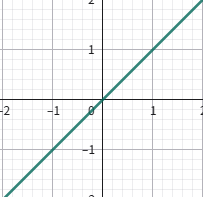
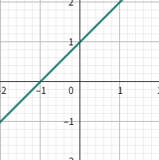
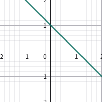
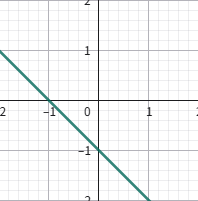
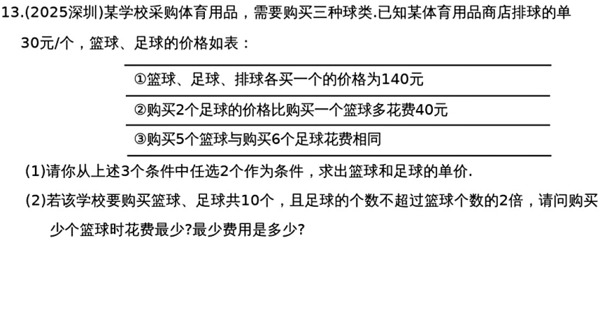
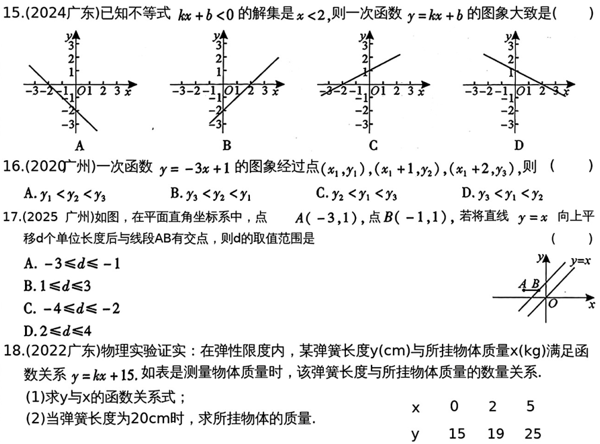

# 第11课 一次函数及其应用
## 知识点

### 知识点1 一次函数及其图象
   1. 形如$y=kx+b（k，b为常数,k\neq 0）,$称$y是x$的一次函数，函数是一条过点$(0,b)$的直线
   2. 特别地，当$b=0$时，$y=kx+b(k \neq 0)$叫做正比例函数，图象是过原点(0,0)的直线

---

### 知识点2 $y=kx+b$的图象及性质
   1. 当$k>0$时，y随x的增大而增大；
   2. 当$k<0$时，y随x的增大而减少。
#### $y=kx(k \neq 0)$的图象：
   |常数项：|$k>0$|$k<0$|
   |-|-|-|
   |$y=kx(k \neq 0)$|||

---
#### $y=kx+b(k \neq 0 ,b \neq 0)$的图象：
   |常数项|$k>0,b>0$|$k>0,b<0$|$k<0,b>0$|$k<0,b<0$|
   |-|-|-|-|-|
   |$y=kx+b(k \neq 0,b \neq 0)$|||||

#### 平移规律：$y=kx$向上平移b个单位长度，得到 $y=kx+b$

---
### 知识点3 待定系数法求一次函数解析式
   1. 正比例函数：设y=kx(求k，只需要一个非原点坐标)
   2. 一次函数，设y=kx+b（求k，b 需要两个点坐标）

---

### 知识点4 一次函数与一元一次方程(或不等式)的联系
   对于一次函数$y=kx+b$:
   1. 当$y=0$时，$kx+b=0$转化为方程。(非0也行，$y$为某值$y_1$时，转化成方程$kx+b=y_1)$
   2. 当$y >0$时，$kx+b>0$，转化为不等式。
---
## 考点
### 考点1 一次函数的图象及性质

---
### 考点2 待定系数法求一次函数解析式

---
### 考点3 一次函数与方程、不等式的关系

---
### 考点4 一次函数的应用

---
## 考题

