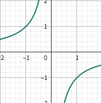

# 第12课 反比例函数

---
## 知识点
### 知识点1 反比例函数的概念
**一般地，形如$y=\frac{k}{x}(k为常数，k\neq 0)$的函数叫做反比例函数，其中，自变量$x \neq 0$。**

---
### 知识点2 反比例函数的图象及性质
1. 反比例函数的图象是双曲线
   
   |条件|图象($\|k\|=1$)|性质|
   |-|-|-|
   |$k>0$||在每个象限内，y随x的增大而减少|
   |$k<0$||在每个象限内，y随x的增大而增大|

2. 双曲线关于原点中心对称且与坐标轴无交点，有两条对称轴。
---
### 知识点3 求反比例函数解析式的步骤
1. 设$y=\frac{k}{x}(k \neq 0)$,待定系数k；
2. 代入图象上的任意一点点坐标求k；
3. 写成解析式
   
----
### 知识点4  k的几何意义
$S_{矩形PAOB}=|xy|=|k|$

---
### 知识点5 反比例函数的应用
1. 已知一次函数和反比例函数的解析式，求两函数的图象的交点坐标，这类题目可通过列方程组来求解；
2. 判断含有同一字母系数的一次函数和反比例函数的图象在同一直角坐标系中的位置情况，可先由两者中的某一图象确定出字母系数的取值情况，再与另一图象相对照解决；
3. 已知含有一个函数或反比例函数的信息，求一次函数或反比例函数的关系式。
   
---
## 考点
### 考点1 反比例函数的图象与性质

---
### 考点2 双曲线与直线的综合

---

### 考点3 反比例函数k的几何意义

---
## 考点

---

