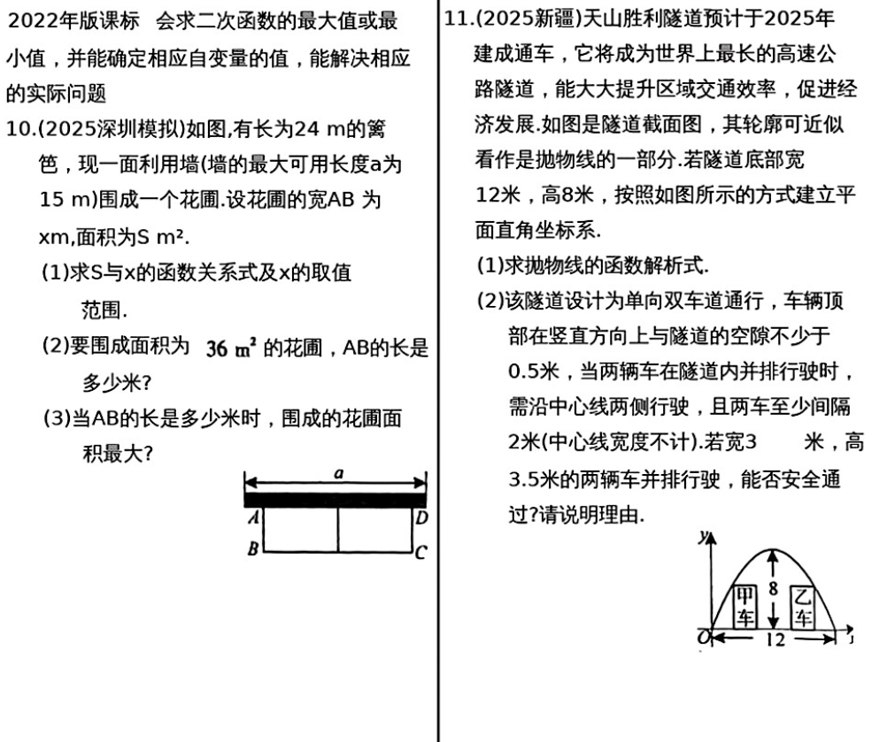

# 第13课 二次函数之一

---
## 知识点1 二次函数的概念
**形如$y=ax^2+bx+c(a,b,c为常数，a \neq 0)$的函数叫二次函数**

*关键：a不能为0 *

---

<!-- _class: small -->
## 知识点2 图象及性质

|条件|$a>0$|$a<0$|
|-|-|-|
|图象|||
|开口方向|向上|向下|
|顶点坐标|$(-\frac{b}{2a},\frac{4ac-b^2}{4a})$|$(-\frac{b}{2a},\frac{4ac-b^2}{4a})$|
|对称轴|直线$x=-\frac{b}{2a}$|直线$x=-\frac{b}{2a}$|
|最值|最小值$\frac{4ac-b^2}{4a}$|最大值$\frac{4ac-b^2}{4a}$|
|增减性|1. 当$x<-\frac{b}{2a}$时，y随x的增大而减小； 2. 当$x>-\frac{b}{2a}$时，y随x的增大而增大；|1. 当$x<-\frac{b}{2a}$时，y随x的增大而增大； 2. 当$x>-\frac{b}{2a}$时，y随x的增大而减少；|

---
## 知识点3 二次函数的平移规律

**左加右减，上加下减**
$y=ax^2   \xrightarrow[\text{上加下减}]{\text{左加右减}} y=a(x-h)^2+k,$
 
其中 h决定左右平移，k决定上下平移。

---
### 知识点4 待定系数法求二次函数解析式
|二次函数解析式|适用条件|
|-|-|
|一般式$y=ax^2+bx+c$|已知任意三点|
|顶点式$y=a(x-h)^2+k$|已知抛物线的顶点及另一点|
|交点式$y=a(x-x_1)(x-x_2)$|已经抛物线与x轴的两个交点及另一点|

---

### 考点1 二次函数的图象及性质

---
### 考点2 求抛物线解析式

---

---
### 考点3 二次函数的应用

---

## 考题

---

---

---