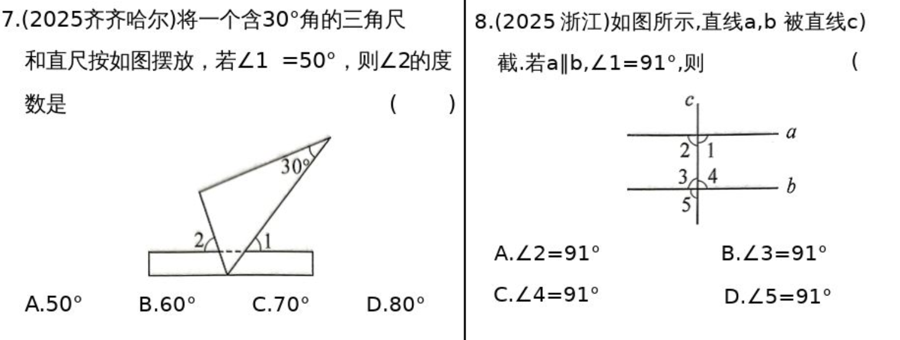
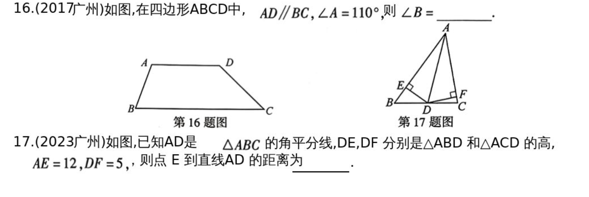

# 第17课 图形初步
## 知识点
---

### 知识点1 直线、射线、线段
|直线公理|经过两点，有且只有一条直线|
|-|-|
|线段公理|两点之间，线段最短|
|两点间距离|连接两点间的线段的长度，叫做两点间的距离|
---
### 知识点2 角
|概念|定义|性质|
|-|-|-|
|角|由有公共端点的两条射线组成的图形叫做角||
|互为余角|如果两个角的和等于90°，那么这两个角互余|同角(或等角)的余角相等|
|互为补角|如果两个角的和等于180°，那么这两个角互补|同角(或等角)的补角相等|
---
### 知识点3 相交线
||性质|
|-|-|
|对顶角|对顶角相等|
|垂直性质1|在同一平面内，过一点有且只有一条直线与已知直线垂直|
|垂直性质2|连接直线外一点与直线上各点的所有线段中，垂线段最短|
|点到直线的距离|直线外一点到这条直线的垂线段的长度，叫做点到直线的距离|

---
### 知识点4 平行线
|概念|在同一平面内，不相交的两条直线叫做平行线|
|-|-|
|公理|经过直线外一点，有且只有一条直线与已知直线平行|
|推论|如果两条直线都与第三条直线平行，那么这两条直线也相互平行|
|判定|同位角相等，两直线平行 内错角相等，两直线平行 同旁内角互补，两直线平行|
|性质|两直线平行，同位角相等 两直线平行，内错角相等 两直线平行，同旁内角互补|
|平行线间距离|定义:过平行线上的一点，作另一条平行线的垂线，垂线段的长度叫做两条平行线的距离 性质:两条平行线间的距离处处相等|

---

### 知识点5 角平分线
1. 角平分线上的点到角两边的距离相等
2. 角的内部到角两边距离相等的点在角的角平分线上

---
### 知识点6 线段的垂直平分线
1. 线段的垂直平分线上的点到线段两端的距离相等
2. 到线段两端相等的点在线段的垂直平分线上

---
## 考点
### 考点1 平行线的性质

---
### 考点2 平行线的判定

---
### 考点3 角平分线与线段垂直平分线

---
## 试题：

---

---