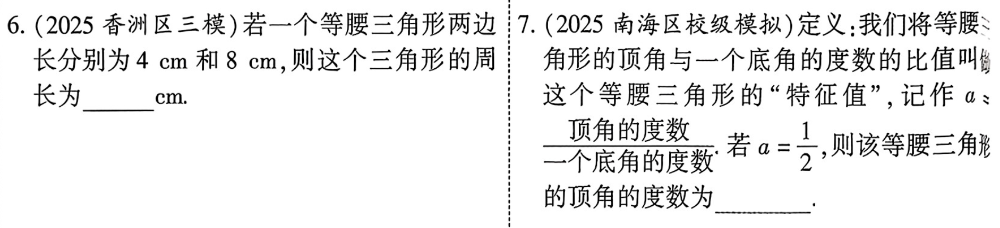
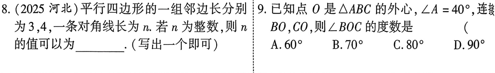

# 第18课 三角形与多边形
---
## 知识点
### 知识点1 三角形的边角关系
1. 三角形的任意两边之和大于第三边，任意两边之差小于第三边
2. 三角形内角和等于180°，外角和等于360°
3. 三角形的一个外角等于与它不相邻的两个内角的和

---
### 知识点2 三角形的主要线段
1. 三角形的角平分线，中线，高
2. 三角形的中位线：三角形的中位线平行与第三边并且等于第三边的一半

---
### 知识点3 三角形的四心
|心|定义|性质|位置|
|-|-|-|-|
|内心|三条角平分线的交点|到三条边的距离相等 是内切圆的圆形|在三角形的内部|
|外心|三边垂直平分线的交点|到三个顶点的距离相等 是外接圆的圆形|锐角三角形:在内部 直角三角形:斜边的中点 钝角三角形:在外部|
|重心|三条中线的交点|把每条中线分成2：1|在三角形内部|
|垂心|三条高的交点||锐角三角形:在内部 直角三角形:直角顶点 钝角三角形:在外部
---
<!-- _class: small -->
**一些推论**

|推论|具体|应用场景|
|-|-|-|
|内心等距性质|角平分线上的点到角两边的距离相等。|到角两边距离相等的点在角平分线上。 证明某点是内心、与内切圆有关的问题。|
|外心等距性质|外心到三角形三个顶点的距离相等。|证明三点共圆； 求外接圆半径； 直角三角形中“斜边中点到三顶点距离相等”。|
|重心 2:1|三角形的重心把每条中线分成 2:1|长度计算、比例问题、坐标题。|
|直角三角形的特殊结论|外心在斜边中点；垂心在直角顶点；斜边中点到三个顶点距离相等。|
|四线必交于一点||判断交点、证明共点。|
|内心与三角形面积|$S=\frac{1}{2}rP(S为三角形面积，r为内切圆半径，p为三角形周长)$|

---

**考场速记口诀**

* `外心找边圆在外`
* `内心分角圆在内`
* `重心中线二比一`
* `垂心三高要注意`

---
### 知识点4 多边形的内角和公式，外角和
1. 多边形的内角和为$180^\circ\cdot(n-2)(n为大于2的整数)$
2. 任意多边形的外角和等于360°，正n边形的每个外角为$\frac{360^\circ}{n}.$
---
### 知识点5 正多边形的镶嵌
1. 平面镶嵌的添加：在每个拼接点处，各多边形的内角之和为360°，且边长相等
2. 用单一的正多边形铺地板是，只有等边三角形，正方形和正六变形可以镶嵌地板
---
## 考点
### 考点1 等腰三角形的边与角

---
### 考点2 三角形的边与角

---
### 考点3 多边形的内角与外角

---
### 考点4 三角形的中线与中位线

---
## 考题

---