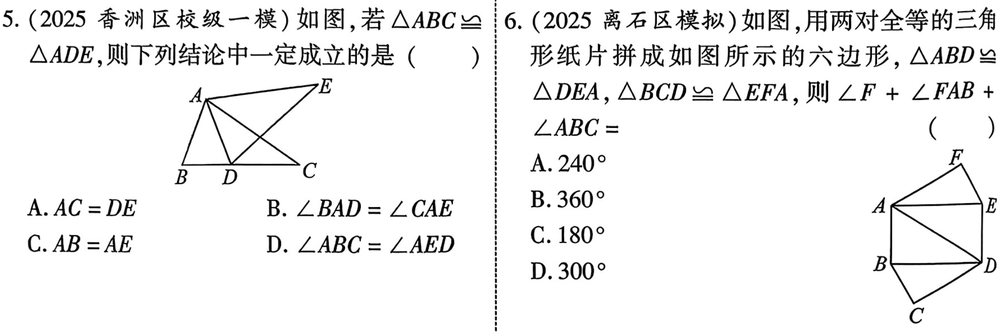
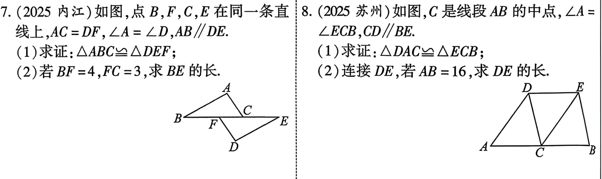
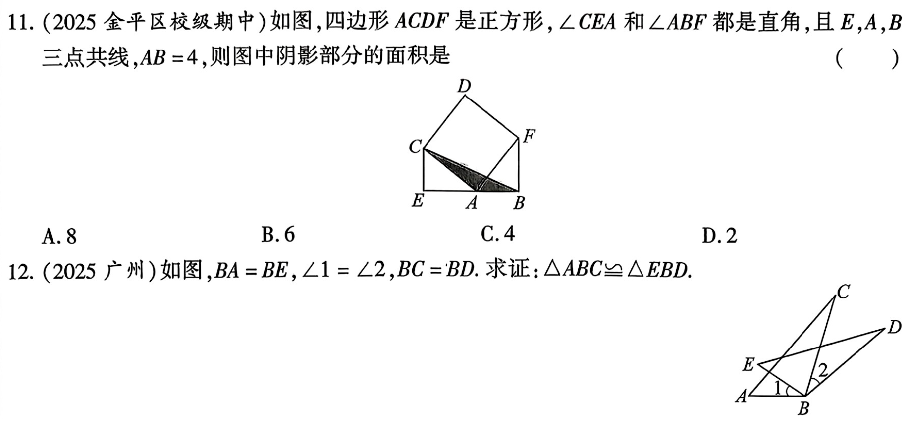

、
---

# 第19课 全等三角形
---
## 知识点
### 知识点1 全等三角形的定义
  能完全重合的两个三角形叫做全等三角形

---
### 知识点2 全等三角形的性质
1. 全等三角形的对应边、对应角相等；
2. 全等三角形的对应角平分线、对应边上的中线、对应边上的高相等
3. 全等三角形的周长相等，面积相等 

---
### 知识点3 全等三角形的判定方法
1. SSS：有三边对应相等的两个三角形全等
2. SAS：有两边和他们的夹角对应相等的两个三角形全等
3. ASA：有两个角和他们的夹边对应相等的两个三角形全等
4. AAS: 有两角和其中一角的对边对应相等的两个三角形全等
5. H L: 有斜边和一条直角边对应相等的两个直角三角形全等
---

### 知识点4 证明全等三角形的思路、

$$
\begin{cases}
\text{已知两边:} \\
\quad 1.\ \text{找夹角} \rightarrow SAS \\
\quad 2.\ \text{找另一边} \rightarrow SSS \\
\quad 3.\ \text{找直角} \rightarrow HL\ \text{或} SAS \\[1mm]
\text{已知一边和一角:} \\
\quad 边为角的对边 \rightarrow \text{找任一角} \rightarrow AAS \\
\quad 边为角的邻边: \\
\quad\quad \text{找夹角的另一边} \rightarrow SAS \\
\quad\quad \text{找夹角的另一角} \rightarrow ASA \\
\quad\quad \text{找边的对角} \rightarrow AAS \\[1mm]
\text{已知两角:} \\
\quad \text{找夹边} \rightarrow ASA \\
\quad \text{找角的对边} \rightarrow AAS
\end{cases}
$$

---
## 考点
### 考点1 全等三角形的性质

---
### 考点2 全等三角形的判定

---

---
## 考题

---
