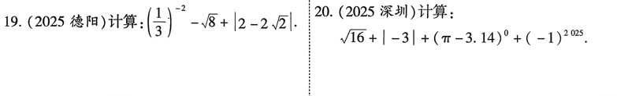

# 第1课 实数
## 知识点
--- 
### 知识点1--相反数
   1. 定义：只有符号不同的两个数互为相反数
   2. 实数$a$的相反数是$-a$，0的相反数是0
   3. 若$a$和$b$互为相反数，则 $a+b=0$ ;反之，若 $a+b=0$，则$a$和$b$互为相反数

----
### 知识点2--倒数
   1. 定义：乘积为1的两个实数互为倒数
   2. a和b互为倒数 $\Leftrightarrow ab=1$
   2. 倒数的求法：求一个分数的倒数，只要将分子、分母颠倒即可；求一个带分数的倒数，应先将带分数化成假分数，再求倒数；求一个小数的倒数，应先将小数化为分数，再求倒数 

---
### 知识点3--绝对值

   1. 定义：数轴上表示数a的点与原点的距离叫数a的绝对值，记在$|a|$
   2. 正数的绝对值是它本身，负数的绝对值是它的相反数，零的绝对值是零
   3. 对于任意的实数a，总有$|a| \geq 0$。
   
$$
    |a|=\left\{
    \begin{aligned}
    a(a \geq 0) \\
    -a(a < 0)
    \end{aligned}
    \right.
$$

---
### 知识点4--科学记数法
   1. 把一个数记作$a \times 10^n$的形式（其中 $1\leq |a| < 10$,n为整数）

---
### 知识点5--近似数
   1.  一个近似数四舍五入到哪一位，那么就说这个近似数精确到哪一位

---
### 知识点6--数轴
   1. 定义：规定了原点、正方向和单位长度的直线叫数轴
   2. 实数与数轴上的点是一一对应的

---
### 知识点7--  有理数与无理数
   1.  有理数：有理数总可以用整数、有限小数或者无限循环小数表示，即有理数可表示成$m/n$的形式吗，其中m，n均为整数，$n \neq 0$。
   2. 无理数：无限不循环小数
   3. 常见无理数举例: $π2\sqrt{2}$,$\sin{35^°}$,1.010010001...

---
####  知识点8-- 实数的分类
$$
   实数\left\{
      \begin{aligned}
         有理数\left\{
            \begin{aligned}
               整数(包括正整、零、负整数)\\
               分数(包括正分数、负分数)
            \end{aligned}
            \right.
          \\
         无理数(无限不循环小数)\left\{
            \begin{aligned}
               正无理数 \\
               负无理数
            \end{aligned}
            \right.
      \end{aligned}
     \right.
$$

---

### 知识点8-- 实数的大少比较
   1. 数轴上的点表示的数，右边的总比左边的大；
   2. 正数都大于0，负数都小于0，两个负数，绝对值大的反而小
   3. 做差比较：$若 a-b>0,则 a>b;\\若 a-b=0,则 a=b；\\若 a-b<0,则 a<b$

---
### 知识点9--   实数的运算
   1.  先乘除，后加减，有括号先算括号里面的；同一级运算按照先从左到右的顺序进行。
   
---
## 考点
### 考点1. 正负数 、相对数、倒数、绝对值、数轴

---
### 考点2. 科学记数法

---
### 考点3. 实数的运算

---
## 考题

---