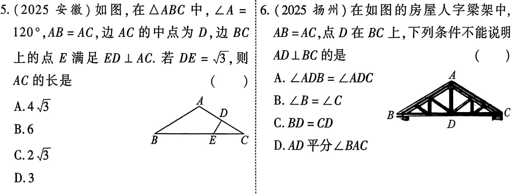
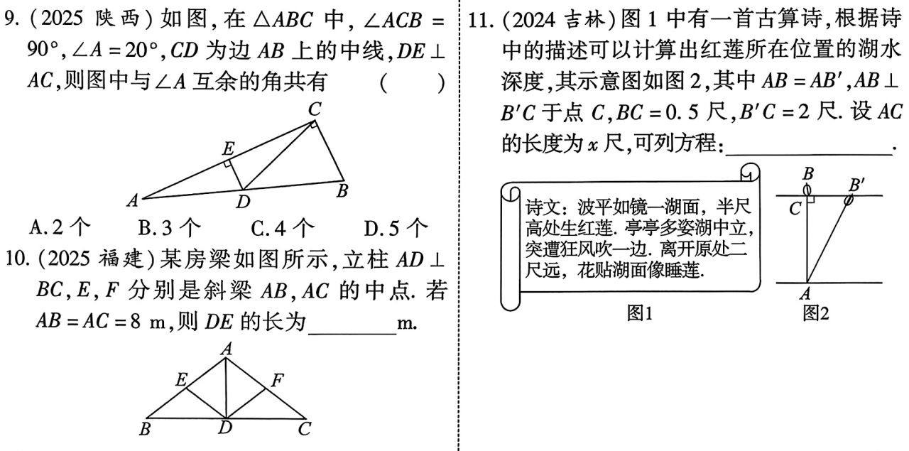
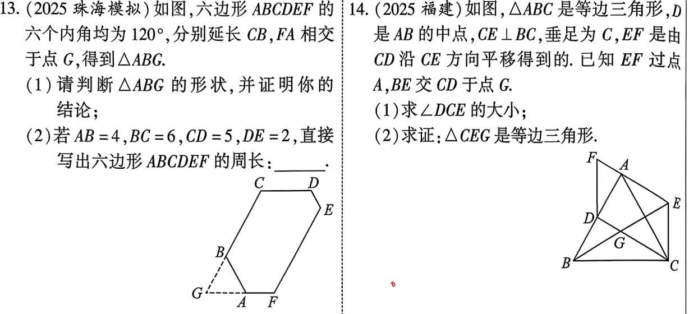
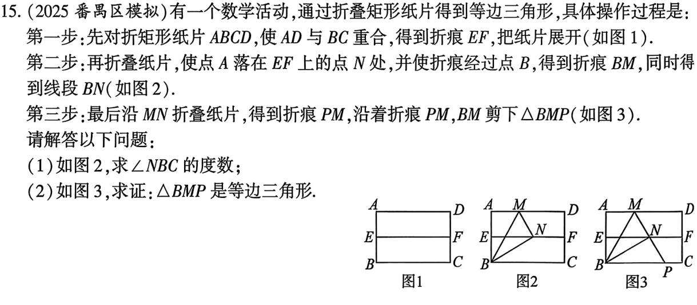

# 第20课 特殊三角形
[下载 PPT](files/20_特殊三角形.pptx){:.md-button--primary }
---
## 知识点
### 知识点1 等腰三角形
1. 性质1：等边对等角，即等腰三角形的两个底角相等
2. 性质2：三线合一，即等腰三角形顶角的平分线，底边上的中线，底边上的高互相重合
3. 判定：
    1. 有两边相等的三角形叫做等腰三角形
    2. 有两个角相等的三角形叫做等腰三角形

---
### 知识点2 等边三角形
1. 性质：
    1. 边：三边相等；
    2. 角：三角相等，都等于60°；
    3. 三线合一
    4. 有3条对称轴
2. 判定：
    1. 三条边都相等的三角形是等边三角形
    2. 三个角都相等的三角形是等边三角形
    3. 有一个角是60°的等腰三角形是等边三角形
3. 等边三角形的面积公式：
    1. $S_{等边\triangle ABC}=\frac{1}{2}BC \cdot AD;$
    2. $S_{等边\triangle   ABC}=\frac{\sqrt{3}}{4}AB^2.$

---

### 知识点3 直角三角形
1. 性质：
    1. 两锐角互余；
    2. 勾股定理：$\because \angle C=90^ \circ,\therefore a^2+b^2=c^2;$
    3. 斜边上的中线等于斜边的一半；
    4. 30°角所对的直角边等于斜边的一半。
2. 判定
    1. 有一个直角的三角形叫做直角三线
    2. 勾股定理的逆定理：如果三角形中两个边的平方和等腰第三边的平方，那么这个三角形就直角三角形
    3. 一条边上的中线等腰该边的一半，则这个三角形是直角三角形
---
### 知识点4 等腰直角三角形
    
    等腰直角三角形的两直角边相等，两个锐角都等于45°

---
## 考点
### 考点1 等腰三角形的性质与判定

---

---
### 考点2 直角三角形、等腰三角形的性质与判定

---

---
### 考点3 等边三角形的性质与判定

---

---
## 考题

