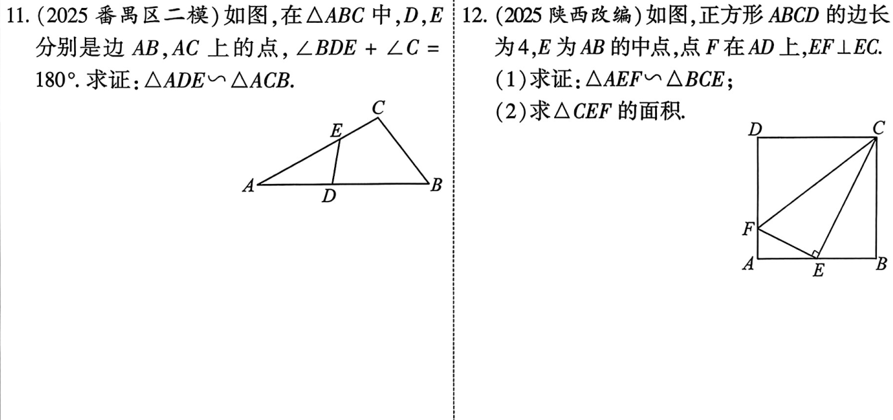
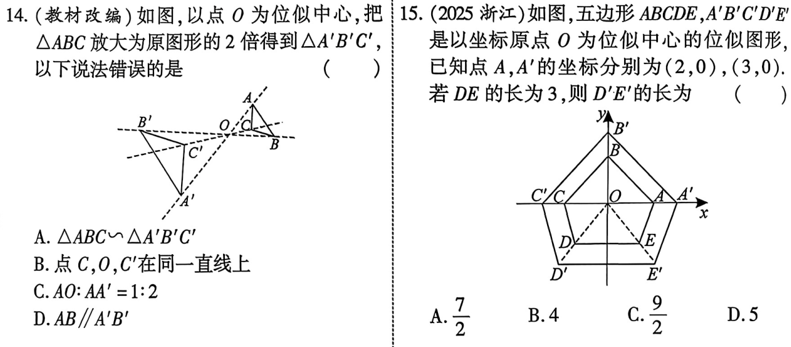

# 第21课 相似
[下载 PPT](files/21_相似.pptx){:.md-button--primary }
## 知识点
---
### 知识点1 比例线段

四条线段a,b,c,d中，如果其中两条线段比等于另外两条线段的比，如$\frac{a}{b}=\frac{c}{d}或a:b=c:d，那么这四条线段叫做比例线段，简称比例线段。$

---

### 知识点2 平行线分线段成比例定理
  1. 三条平行线截两条直线，所得的对应线段的比相等；
  2. 平行于三角形的一边的直线截其他两边，所得的对应线段的比相等

---

### 知识点3 相似的概念与性质
  1. 相似的概念: 形状相同(大小不一定相同)的图形称为相似图形
  2. 相似多边形的性质:
     1. 对应角相等，对应边的比相等
     2. 周长之比等于相似比，面积之比等于相似比的平方
     3. 对应高之比，对应中线之比，对应角平分线之比都等于相似比。 

---

### 知识点4 相似三角形的判定
  1. 判定1：两角对应相等的两个三角形相似
  2. 判定2：三边对应成比例的两个三角形相似
  3. 判定3：两边对应成比例且夹角相等的两个三角形
  4. 判定4：平行于三角形一边的直线和其他两边相交，所构成的三角形与原三角形相似   
---

## 知识点5 相似三角形常用的基本图形

---

---

## 知识点6 位似的概念
    两个多边形不仅相似，而且对一点的连线相交于一点，对应边相互平行或在同一直线上，这样的相似叫做位似，这个交点叫做位似中心

---

## 考点1 平行线分线段成比例

---

## 考点2 相似的性质

---

## 考点3 相似的判定

---

---

## 考点4 位似、位似比、位似作图

---

## 考点5 相似的综合应用

---

---

## 考题

---

