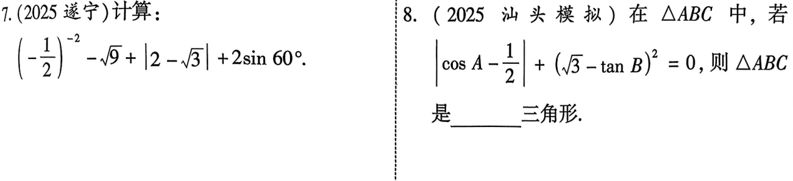
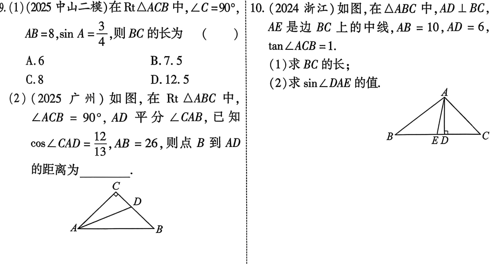
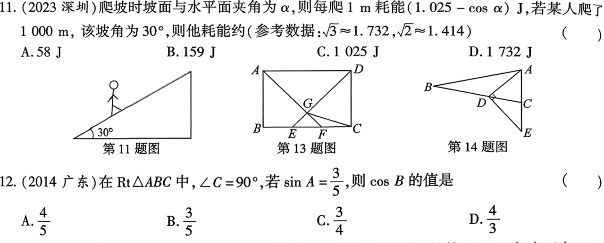
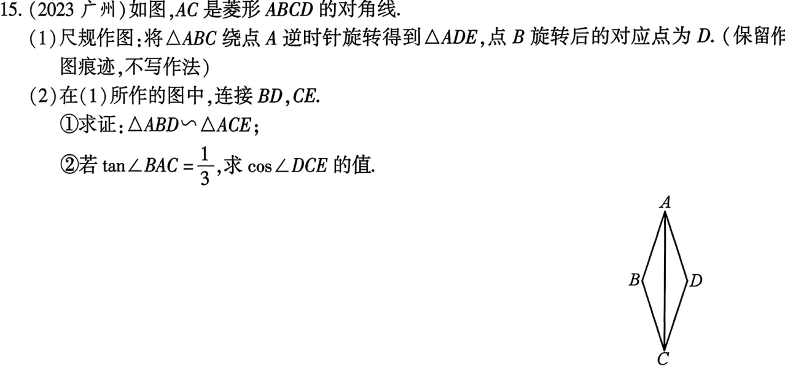

# 第22课 锐角三角函数
[下载 PPT](files/22_锐角三角函数.pptx)

---
## 知识点
### 知识点1 锐角三角函数的定义

如图，在$Rt_{\triangle}ABC中，\triangle C=90^\circ,则：$
$正弦:\sin A=\frac{\angle A的对边}{斜边}=\frac{a}{c}$
$余弦:\cos A=\frac{\angle A的临边}{斜边}=\frac{b}{c}$
$正弦:\tan A=\frac{\angle A的对边}{\angle A的临边}=\frac{a}{b}$

---
### 知识点2 特殊的锐角函数值
|$\alpha$|$30^\circ$|$45^\circ$|$60^\circ$|
|-|-|-|-|
|$\sin \alpha$|$\frac{1}{2}$|$\frac{\sqrt{2}}{2}$|$\frac{\sqrt{3}}{2}$|
|$\cos \alpha$|$\frac{\sqrt{3}}{2}$|$\frac{\sqrt{2}}{2}$|$\frac{1}{2}$|
|$\tan \alpha$|$\frac{\sqrt{3}}{3}$|$1$|$\sqrt{3}$|

---

### 知识点3 求出直角三角形所有未知边与角的过程叫解直角三角形

|三边关系|$a^2+b^2=c^2$|
|-|-|
|两锐角关系|$\angle A+\angle B=90^\circ$|
|边角关系|$\sin A =\cos B=\frac{a}{c}$ $\cos B=\sin A=\frac{b}{c}$ $\tan A=\frac{a}{b},\tan B=\frac{b}{a}$|

---

### 知识点4 等角的三角函数关系
 若$\angle 1=\angle 2,则$
 $\sin \angle 1=\sin \angle 2$
$\cos \angle 1=\cos \angle 2$
$\tan \angle 1=\tan \angle 2$

## 考点
---
### 考点1 求$\sin A, \cos A ,\tan A$的值

---

### 考点2 特殊角饿三角函数值计算

---

### 考点3 解直角三角形

---

## 考题

---

---

---