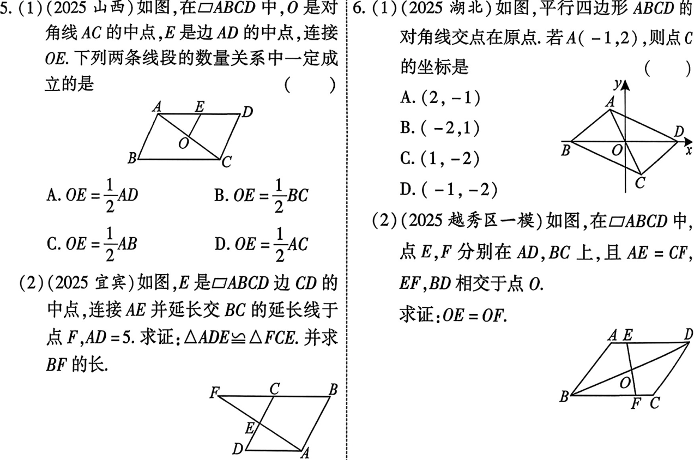
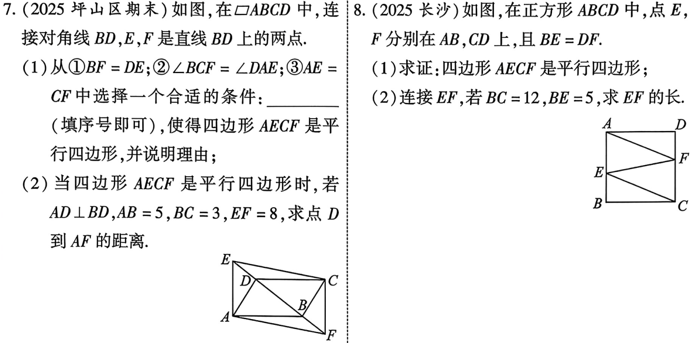

# 第24课 平行四边形
[下载 PPT](files/24_平行四边形.pptx)
## 知识点
---
### 平行四边形的性质
|文字表述|数学表述|
|-|-|
|平行四边形的两组对边分别平行|$\because 四边形ABCD是平行四边形$ $\therefore AB//CD 且 AD//BC .$|
|平行四边形的两组对边分别相等|$\because 四边形ABCD是平行四边形$ $\therefore AB=CD 且 AD=BC .$|
|平行四边形的两组对角分别相等|$\because 四边形ABCD是平行四边形$ $\therefore \angle A= \angle C 且 \angle B =\angle D$|
|平行四边形的对角线互相平分(O是对角线交点)|$\because 四边形ABCD是平行四边形$$\therefore OA=OC 且 OB=OD .$|

---

### 平行四边形的判定
|文字表述|数学表述|
|-|-|
|两组对边分别平行的四边形是平行四边形|$\because AB//CD 且 AD//BC,$ $\therefore 四边形是平行四边形$|
|两组对边分别相等的四边形是平行四边形|$\because AB=CD 且 AD=BC,$ $\therefore 四边形是平行四边形$|
|两组对角分别相等的四边形是平行四边形|$\because \angle A=\angle C 且 \angle B=\angle D,$ $\therefore 四边形是平行四边形$|
|对角线互相平分的四边形是平行四边形|$\because OC=OA 且 OB=OD,$ $\therefore 四边形是平行四边形$|
|一组对边平行且相等的四边形是平行四边形|$\because AB// CD,\; AB = CD 或(AD//BC,AD=BC),$ $\therefore 四边形是平行四边形$|

---
### 平行四边形的周转与面积
$C_{▱ABCD}=2(AB+BC)$  
$S_{▱ABCD}=BC \cdot AE$

---
### 两平行线间的距离

两条平行线中，一条直线上的任意一点到另一条直线的距离，叫做这两条平行线的距离，平行线间的距离处处相等。

---
## 考点
---
### 平行四边形的性质

---

### 平行四边形的判定

---

### 考题

---