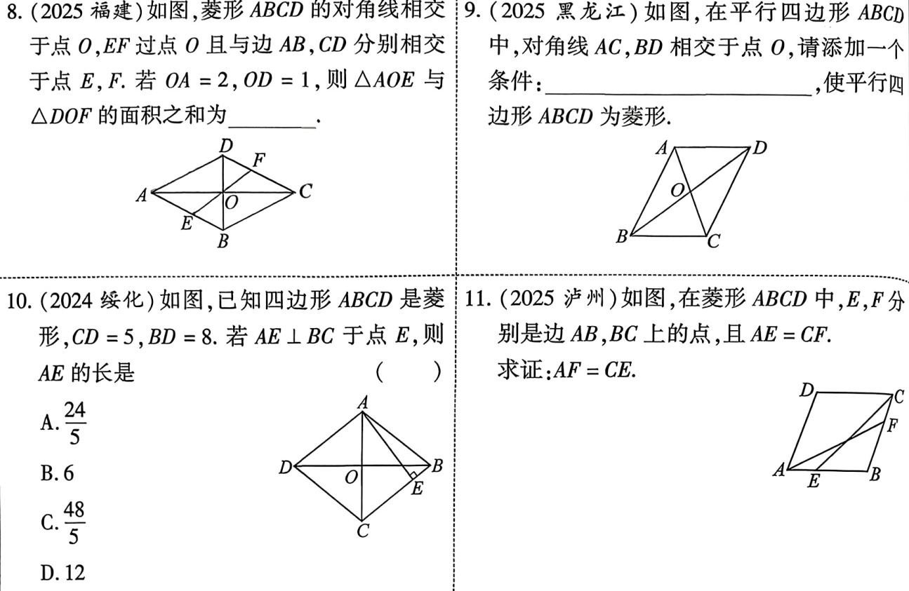
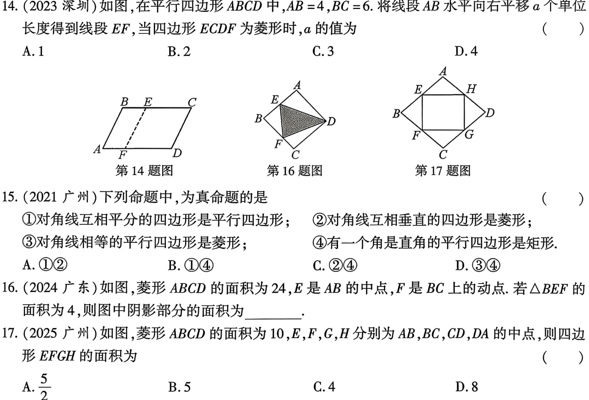

# 第25课 矩形与菱形
[下载 PPT](files/25_矩形与菱形.pptx)
## 知识点
---
### 定义、周长、面积

|图形|定义|周长|面积|
|-|-|-|-|
|矩形|有一个角是直角的平行四边形|$C_{\text{矩形}}=2(\text{长}+\text{宽})$|$S_{\text{矩形}}=\text{长} \times \text{宽}$|
|菱形|有一组邻边相等的平行四边形|$C_{\text{菱形}}=4 \times \text{边长}$|$S_{\text{矩形}}=\text{底} \times \text{高}$$S_{\text{矩形}}=对角线乘积的一半$|

---
### 性质

||矩形|菱形|
|-|-|-|
|性质1|具有平行四边形的一切性质|具有平行四边形的一切性质|
|性质2|四个角都是直角|四条边都相等|
|性质3|对角线相等|对角线互相垂直，并且对角线平分对角|
|性质4|中心对称图形和轴对称图形|中心对称图形和轴对称图形|

---
### 判定

||矩形|菱形|
|-|-|-|
|判定1|有一个角是直角的平行四边形|有一组邻边相等的平行四边形|
|判定2|对角线相等的平行四边形|对角线互相垂直的平行四边形|
|判定3|有三个角是直角的四边形|四边都相等的四边形|

---
## 考点
---
### 矩形的性质与判定

---
### 菱形的性质与判定

---

---
## 考题
---
