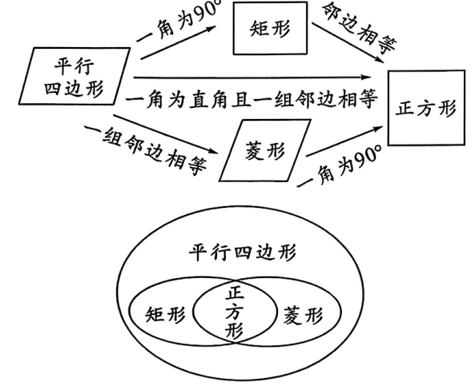
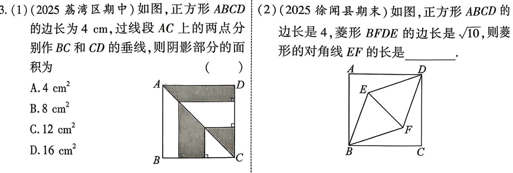
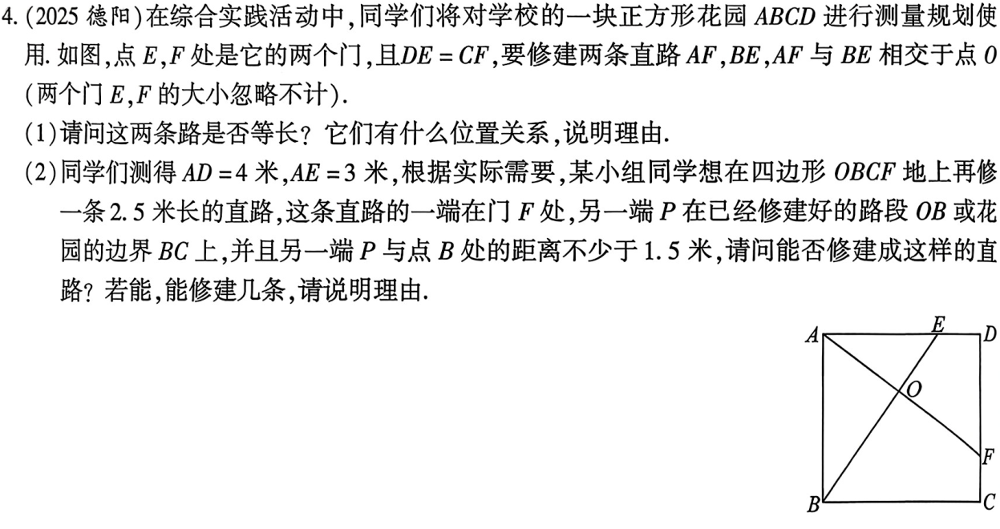
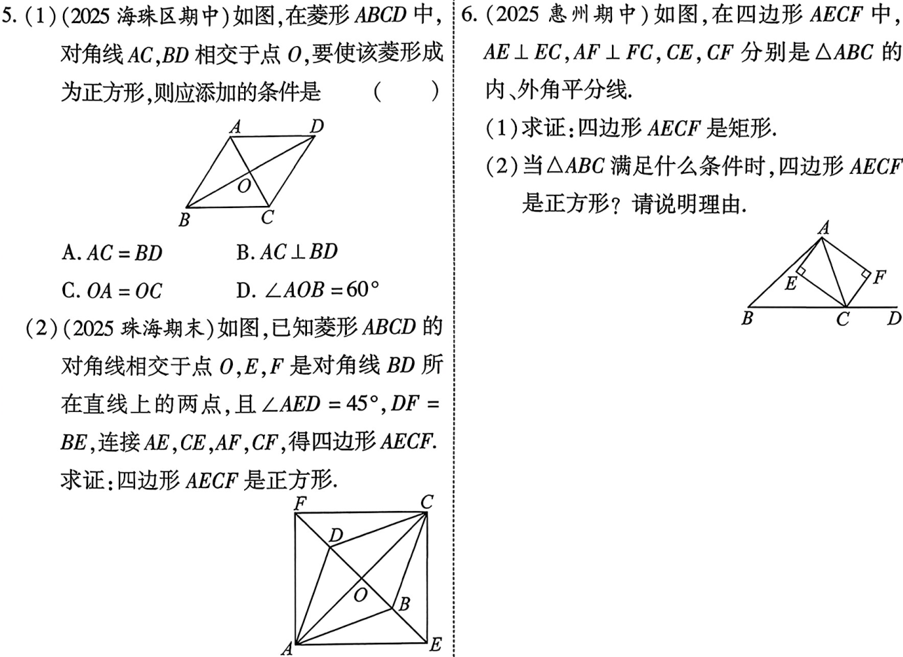
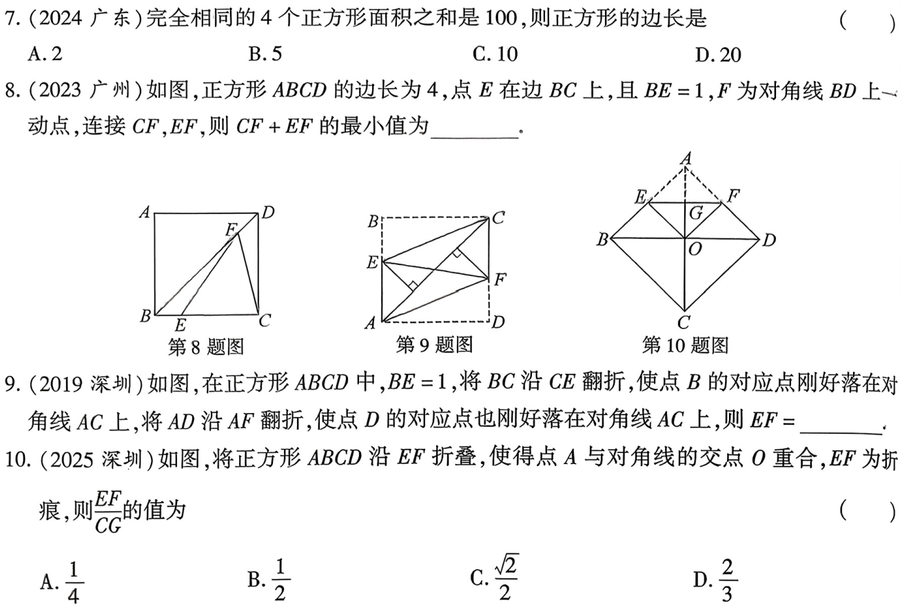

# 第26课 正方形
[下载 PPT](files/26_正方形.pptx)
## 知识点
---
### 正方形的定义及性质
1. 正方形的定义：有一组邻边相等，并且有一个角是直角的平行四边形叫做正方形
2. 正方形的性质:
    1. 既具有矩形的性质又具有菱形的性质；
    2. 四个角都是直角，四条边都相等
    3. 两条对角线相等，并且互相垂直平分，每条对角线平分一组对角
    4. 既是中心对称图形也是轴对称图形
3. 周长与面积:
    $C_{\text{正方形ABCD}}=4AB,S_{\text{正方形ABCD}}=AB^2=\frac{1}{2}AC^2$

---
### 正方形的判定
1. 思路一：先证矩形，后证菱形
     1. 有一组邻边相等的矩形是正方形
     2. 对角线互相垂直的矩形是正方形
2. 思路二：先证菱形，后证矩形
     1. 有一个角是90°的菱形是正方形
     2. 对角线相等的菱形是正方形
  
---
 

---
## 考点
### 正方形的性质

---

---
### 正方形的判定

---

---
## 考题

---

