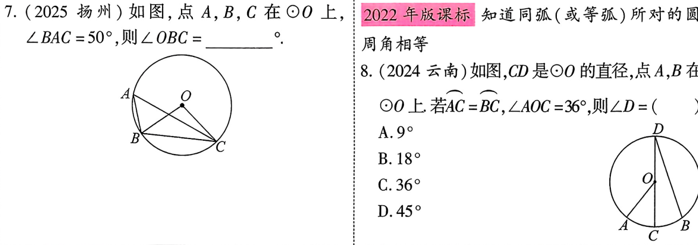
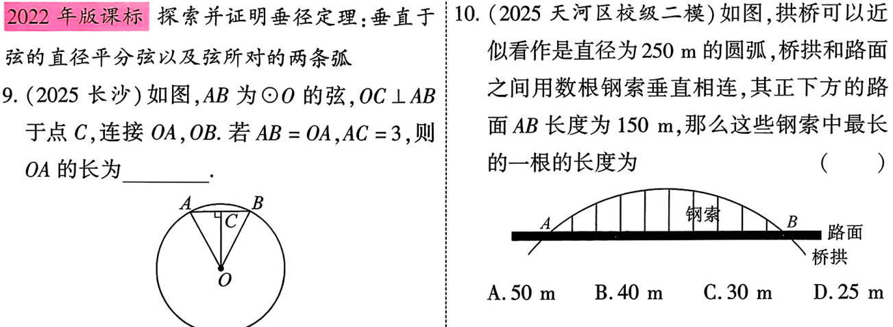
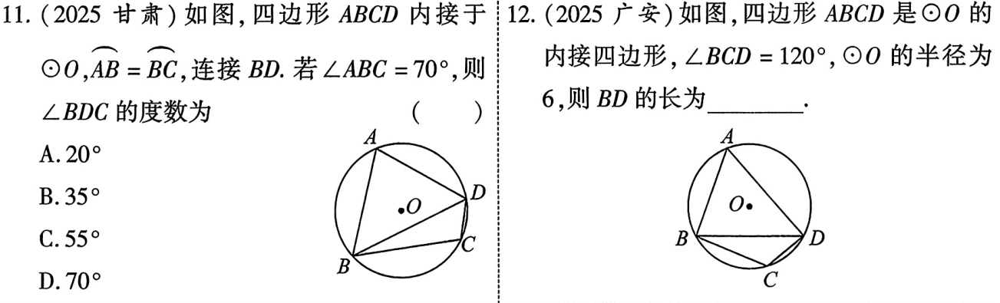
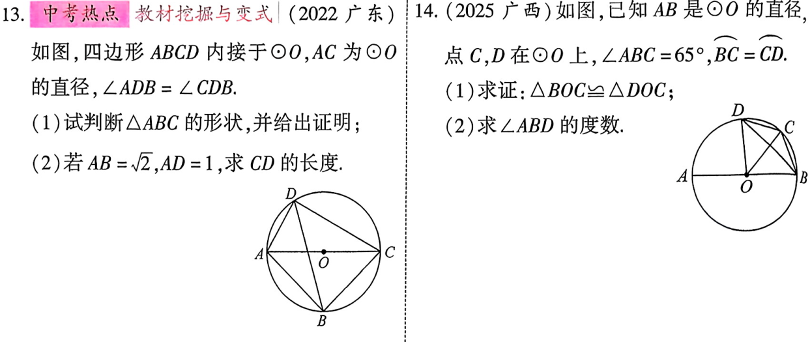
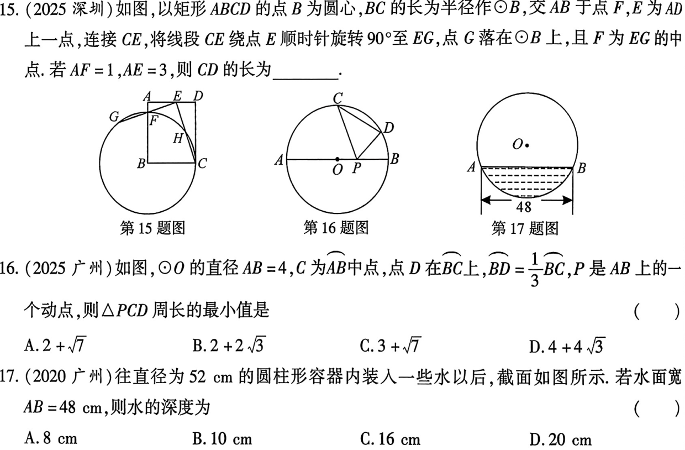

<!-- _backgroundColor: #0f172a -->
<!-- _color: white -->
<!-- _class: big -->
# 第27课 与圆有关的概念及性质
---

[下载 PPT](files/27_与圆有关的概念及性质.pptx)
## 知识点
---
### 圆的有关概念
1. **弦**：连接圆上任意两点间的线段叫做弦，经过圆心的弦是直径；
2. **弧**：圆上任意两点间的部分叫弧，大于半圆的弧叫优弧，小于半圆的弧叫劣弧，半圆也是弧
3. **等弧**：在同圆或等圆中，能够完全重合的弧叫做等弧。
   
---
### 圆的对称性
1. 圆是轴对称图形，其对称轴是任意一条过圆心的直线
2. 圆是中心对称图形，对称中心是圆心

---
### 垂径定理及其推论
1. **垂径定理**：垂直与弦的直径平分这条弦，并且平分弦所对的两条弧
2. **垂径定理的推论**：平分弦(不是直径)的直径垂直与弦，并且平分弦所对的两条弧

---
### 弧、弦、圆心角的关系
1. **定理**：在同圆或等圆中，相等的圆心角所对的弧相等，所对的弦相等
2. **推论**：在同圆或等圆中，如果两个圆心角，两条弧，两条弦中有一组量相等，那么他们所对应的其余各组量也分别相等。

---
### 圆周角定理及其推论
1. **定理**：一条弧所对的圆周角等于它所对的圆心角的一半；
2. **推论**：
   1. 同弧或等弧所对的圆周角相等；同圆或等圆中，相等的圆周角所对的弧也相等；
   2. 半圆或直径所对的圆周角是90°，90°的圆周角所对的弦是直径，所对的弧是半圆。

---
### 圆内接四边形对角互补
 四边形ABCD是圆内接四边形，则$\angle A+ \angle C=\angle B+\angle D=180^\circ.$

 ---
 ## 考点
 ### 圆心角、圆周角、弦、弧之间的关系

 
 ---
### 垂径定理及其推论

---

### 圆内接四边形、圆周角定理

---

---
## 考题

