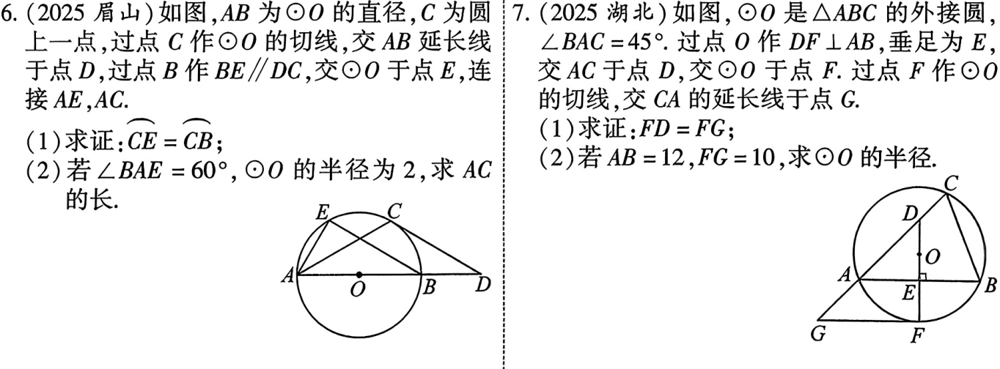
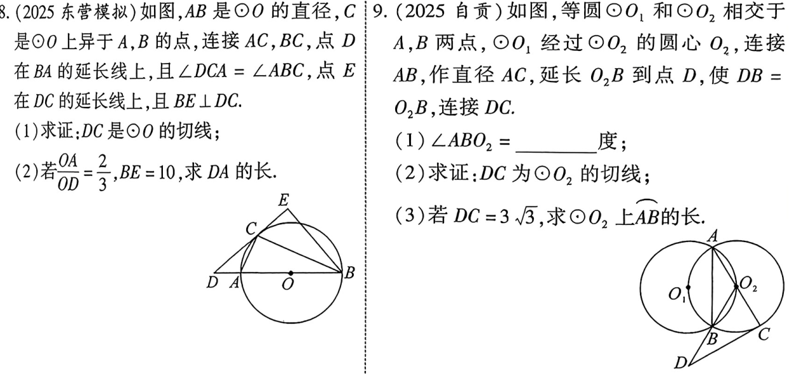
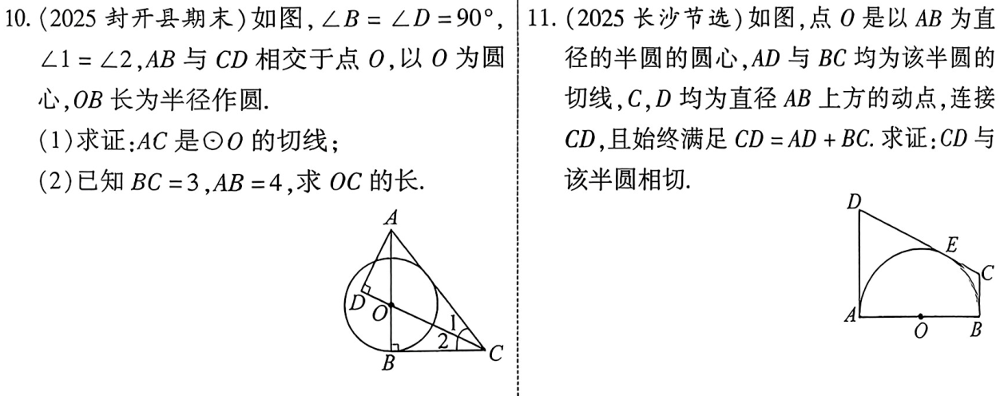
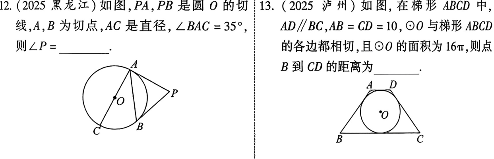
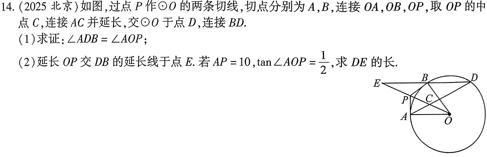
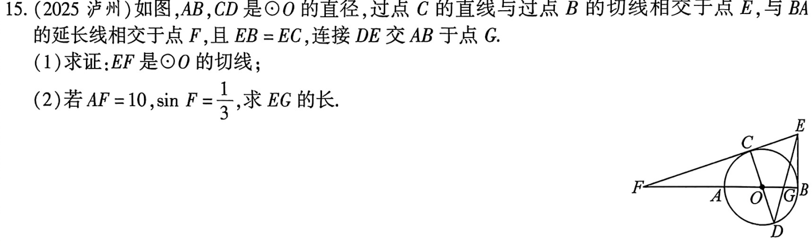
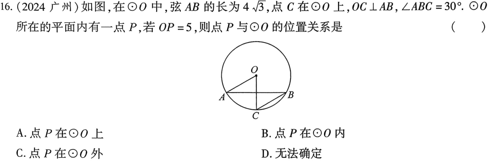
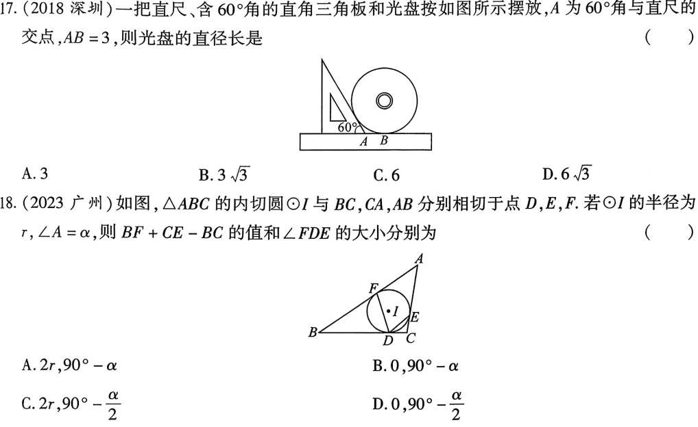

<!-- _backgroundColor: #0f172a -->
<!-- _color: white -->
<!-- _class: big -->
# 第28课 与圆有关的位置关系
---
[下载 PPT](files/28_与圆有关的位置关系.pptx)
## 知识点

---
### 点与圆的位置关系
  若$\odot O$的半径为r，圆心O到点P的距离为d，
1. $d<r  \Longleftrightarrow 点P在圆内$;
2.  $d=r  \Longleftrightarrow 点P在圆上$;
3.  $d>r  \Longleftrightarrow 点P在圆外$。

---
### 直线与圆的位置关系
  若$\odot O$的半径为r，圆心O到直线l的距离为d，
1. $d<r  \Longleftrightarrow 直线与圆相交$;
2.  $d=r  \Longleftrightarrow 直线与圆相切$;
3.  $d>r  \Longleftrightarrow 直线与圆相离$。

---
### 切线的性质与判定
1. **性质**：
   1. **性质1**：圆心到切线的距离等于半径；
   2. **性质2**：圆的切线垂直与过切点的半径。
2. **判定**：
   1. **判定1**: 经过半径的外端并且垂直于这条半径的直线是圆的切线
   2. **判定2**: 设圆的半径为r，圆心到直线l的距离为d，若d=r，则直线与圆相切
   3. **判定3**: 若直线与圆有且只有一个公共点，则这条直线是圆的切线

---
### 切线长定理
  从圆外一点可以引圆的两条切线，他们的切线长相等，这一点和圆心的连线平分这两条切线的夹角。

---
### 三角形的外心与内心
1. 三角形的外心：
   1. 定义：三角形外接圆的圆心：
   2. 性质：外心到三个顶点的距离相等
   3. 作法：作三角形两边的垂直平分线，其交点为外接圆的圆心
2. 三角形的内心：
   1. 定义：三角形内切圆的圆心：
   2. 性质：内心到三条边的距离相等
   3. 作法：作三角形两条角平分线，其交点为内切圆的圆心
---
## 考点
### 切线的性质

---

### 切线的判定

---

---

### 切线长定理

---

---

---

## 考题

---

