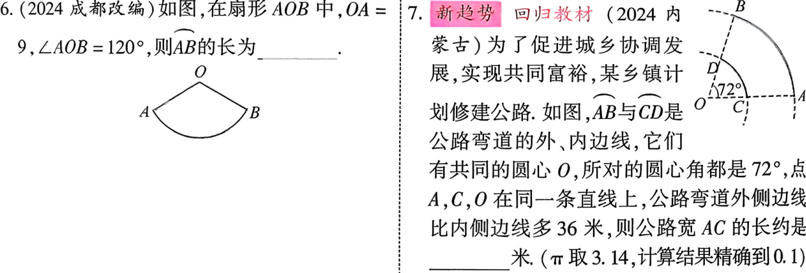
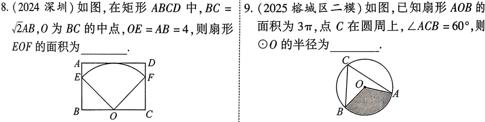
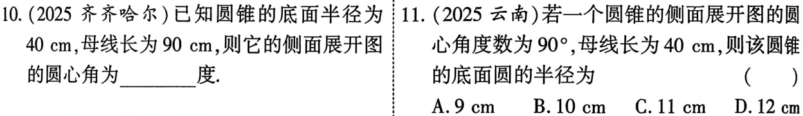
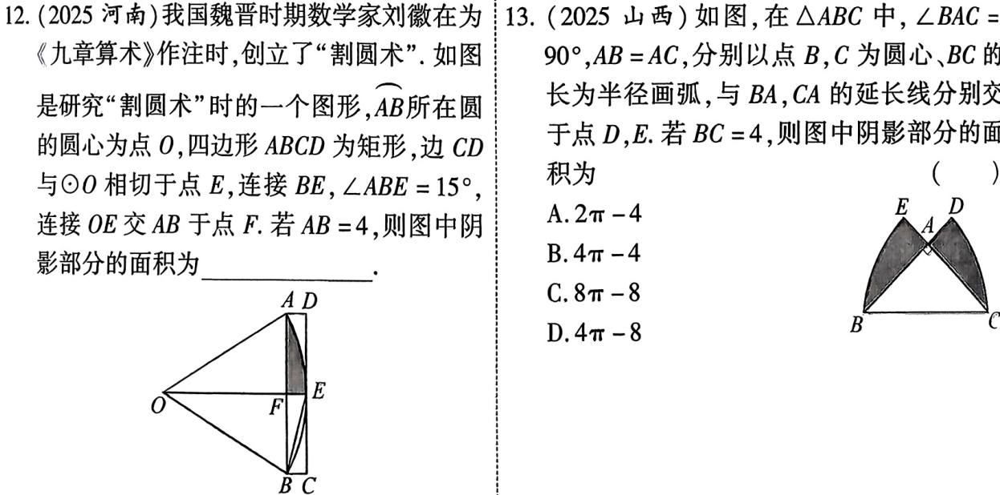
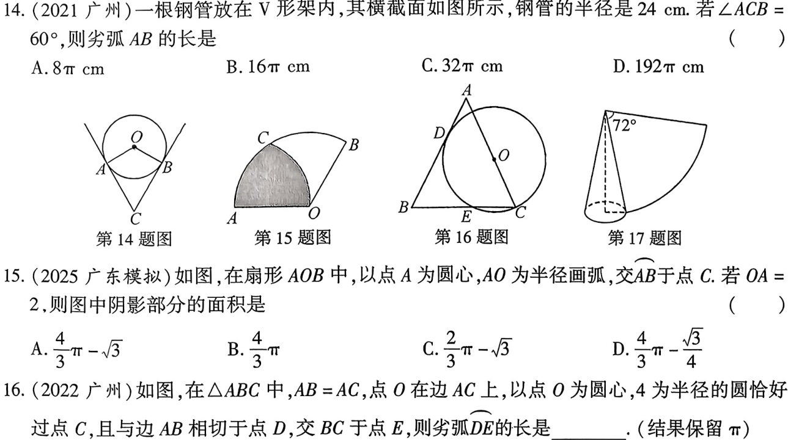
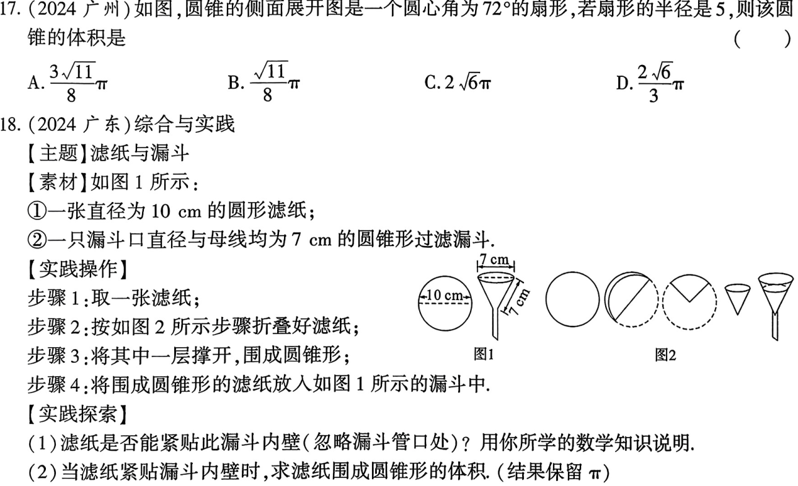

<!-- _backgroundColor: #0f172a -->
<!-- _color: white -->
<!-- _class: big -->

# 第29课 与圆有关的计算
---
[下载 PPT](files/29_与圆有关的计算.pptx)
## 知识点
---
### 圆周长、弧长计算
1. 圆的周长：$C=2\pi r$
2. 弧长：$l=\frac{n}{360}\cdot2 \pi r=\frac{n \pi r}{180}$
   
### 圆、扇形面积计算
1. 圆的面积：$S=\pi r^2$
2. 扇形面积：$S_{扇形}=\frac{n}{360}\cdot \pi r^2=\frac{1}{2}lr$
3. 扇形周长：$\frac{n \pi r}{180}+2r$

---
### 圆锥的有关计算
1. 圆锥的侧面展开图是扇形:$S_{圆锥侧}=\pi r a$
2. 底面圆周长=侧面展开扇形的弧长

$S_全=\pi r a+ \pi r^2$
---
### 圆柱的有关计算
1. 圆柱的侧面张开图是矩形
2.  $S_侧=2\pi rh;$
   $S_全=2\pi rh+2\pi r^2$

---
### 正多边形与圆
1. 正多边形的外接圆的圆心叫正多边形的中心
2. 正n边形每一边所对的圆心叫叫做他的中心角，每一个中心角$=\frac{360^\circ}{n}$;
3. 正n边形的中心到他一边的距离叫做他的边心距
4. 正n边形的每个内角$=\frac{180^\circ(n-2)}{n}$,每个外角$=\frac{360^\circ}{n}$;
5. 正n边形周长=$n\cdot\text{边长}$；正n边形面积=$\frac{1}{2}\times \text{周长} \times \text{边心距}$

---
## 考点
### 弧长的相关计算

---

### 扇形的相关计算、

---
### 圆锥的相关计算

---

### 与圆有关的阴影面积计算

---
## 考题
---

---

---