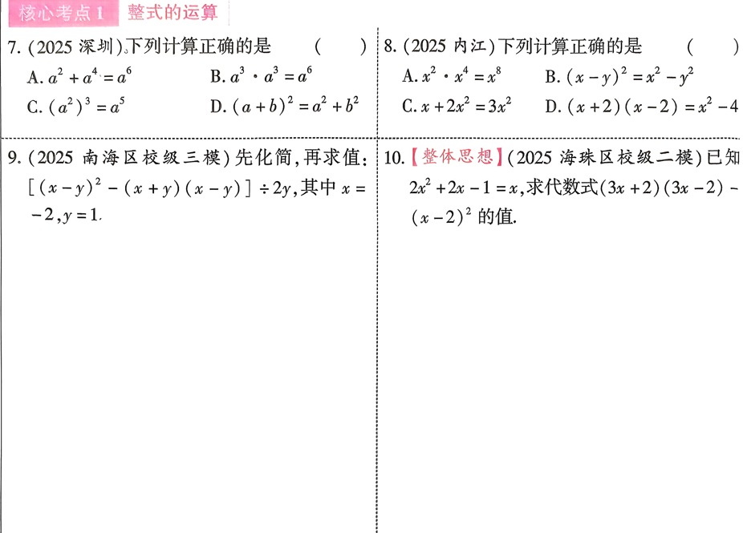
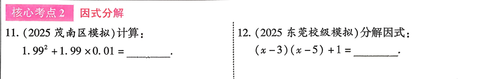
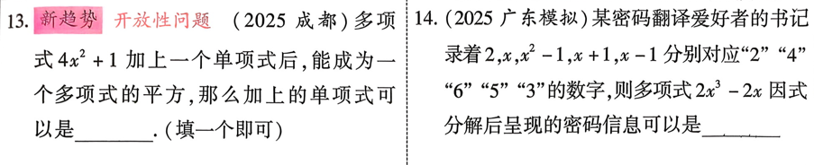
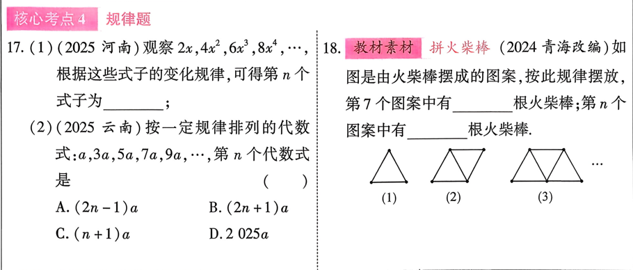
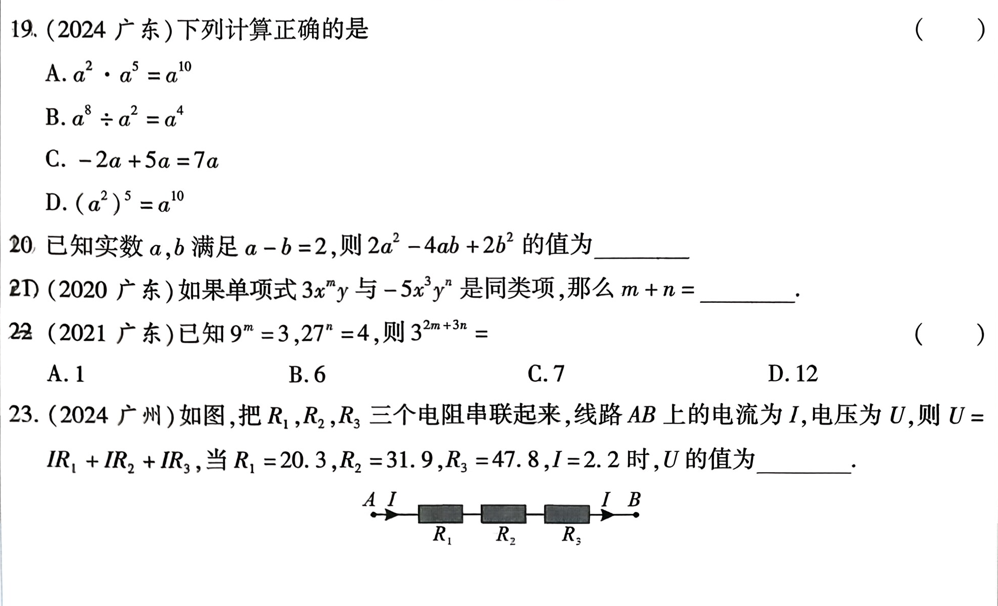

# 第二课   整式(含因式分解)

---
## 知识点
### 知识点1 定义 
   1. 单项式：数与字母的积所表示的代数式叫做单项式，单独一个数或者一个字母也是单项式
   2. 多项式：多个单项式的和叫做多项式
   3. 整式： 单项式与多项式统称为整式
   4. 同类项：所含字母相同并且相同字母的指数也相同的项叫做同类项
   5. 合并同类项法则：把同类项重的系数相加，所得结果作为系数，字母和字母的指数保持不变
---
### 知识点2 幂的运算
$$
   \begin{align}
     &a^m \cdot a^n=a^{m+n} ;\\
     &(a^m)^n=a^{mn}; \\
     &(ab)^m=a^mb^n;  \\
     &a^m \div a^n=a{m-n}(a \neq 0); \\
     &a^0=1(a \neq 0); \\
     &a^{-m}=\dfrac{1}{a^m}(a \neq 0).
   \end{align}
$$

---
### 知识点3 整式的运算
   1. 整式的加法： 先去括号在合并同类项。
   2. 整式的乘法：
      1. 单项式乘单项式
      2. 单项式乘多项式
      3. 多项式乘单项式
   3. 整式的除法
   4. 整式的混合运算

---

### 知识点4 乘法公式
   1. 平方差公式:$(a+b)(a-b)=a^2-b^2 ;$
   2. 完全平方公式:$(a \pm b)^2=a^2 \pm2ab+b^2 ;$

---

### 知识点5 因式分解
  1. 定义：把一个多项式化成多个整式乘积的形式，叫做因式分解
  2. 方法：
      1. 提公因式法：$ma+mb+mc=m(a+b+c);$
      2. 公式法:$a^2-b^2=(a+b)(a-b); a^2\pm2ab+b^2=(a\pm b)^2$
  3. 步骤
      1. 若有公因式，应先提公因式；
      2. 看是否可用公式
      3. 检查各因式能否继续分解

---

## 核心考点
### 考点1 整式的运算

---
### 考点2 因式分解

---
### 考点3 求代数式的值(整体思路)

---
### 考点4 规律题

---
## 考题

---