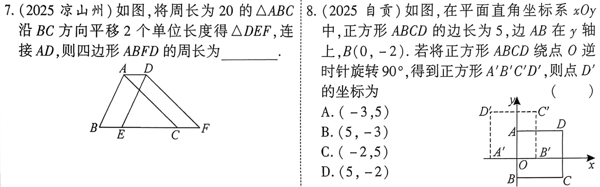
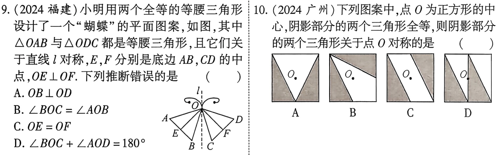
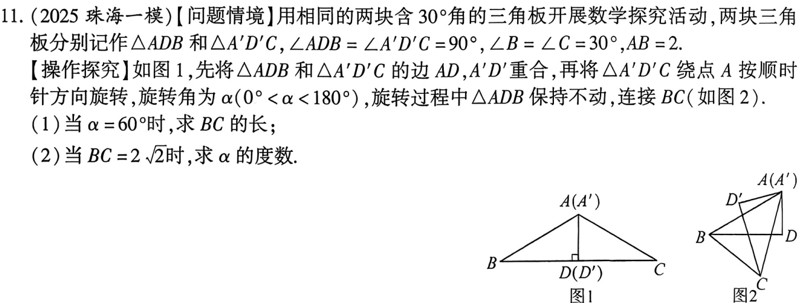
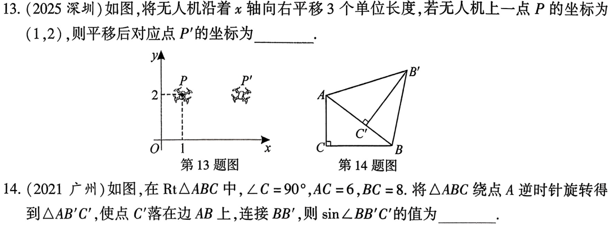
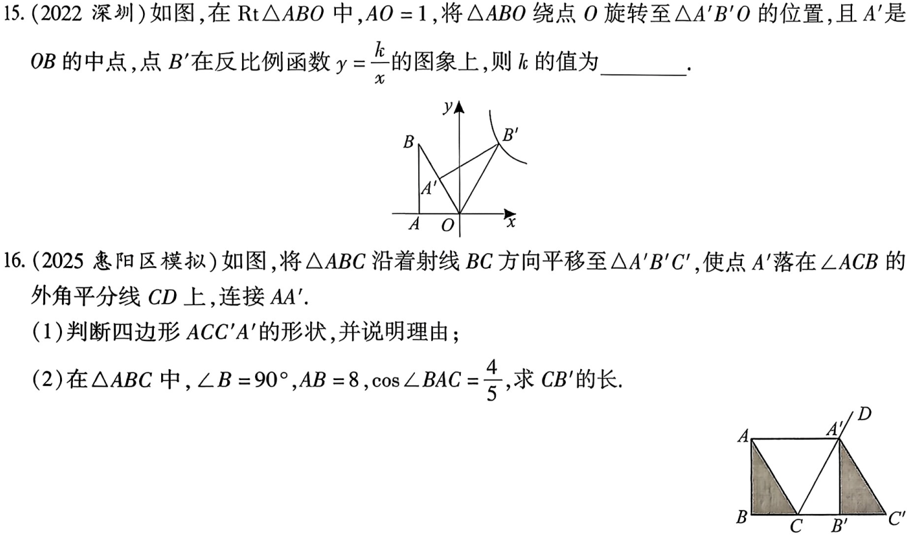

<!-- _backgroundColor: #0f172a -->
<!-- _color: white -->
<!-- _class: big -->

# 第30课 平移对称旋转对折
---
[下载 PPT](files/30_平移对称旋转对折.pptx)
## 知识点
---
### 平移
在平面内，将一个图形沿着某个方向移动一定的的距离，这样的图形变换成为平移。
1. 平移的特点：平移不改变图形的形状和大小，平移前后两图形全等。
2. 平移的基本性质：对应点所连的线段平行（或在一条直线上）且相等，对应线段平行（或在一条直线上）且相等，对应角相等。
   
---
### 对称
1. 轴对称图形: 如果一个图形沿一条直线折叠，直线两旁的部分能够互相重合，这个图形就叫做轴对称图形，这条直线就是它的对称轴
2. 轴对称: 把一个图形沿着某一个直线折叠，如果它能够与另一个图形重合，就说这两个图形关于这条直线对称，这条直线叫做对称轴，折叠后重合的点是对应点，叫做对称点。

---
### 旋转
1. 定义:在平面内，将一个图形绕一个定点沿某个方向转动一个角度，这样的图形变换称为旋转，这个定点称为旋转中心，旋转的角度称为旋转角。
2. 旋转的特点: 旋转不改变图形的形状和大小，旋转前后的两图形全等
3. 旋转的基本性质：图形经过旋转后，对应点旋转的角度都相等，旋转方向都相同，对应点到旋转中心的距离相等，且对应线段，对应角相等。
4. 中心对称图形：一个图形绕着某一个点旋转180°后能与原来的图形重合，那么这个图形叫做中心对称图形。
   
---

### 图形变换与坐标变换
已知点P(x,y)
1. 点P向右(左)平移a个单位长度得点$(x \pm a,y)$
2. 点P向上(下)平移a个单位长度得点$(x,y \pm a)$
3. 点P关于原点中心对称的点点$(-x,-y)$
4. 点P绕原点顺时针旋转90°得点$(y,-x)$
5. 点P关于x轴对称的点$(x,-y)$
6. 点P关于y轴对称的点$(-x,y)$
----
### 对折的特征

图形对折后重合的两个图形全等

----
### 网格作图
1. 平移
2. 轴对称
3. 中心对称
4. 旋转
5. 位似

---
## 考点
### 平移与旋转的性质

---
### 轴对称图形与中心对称图形

---

### 平移旋转对折的相关计算及证明

---

## 考题

---

---