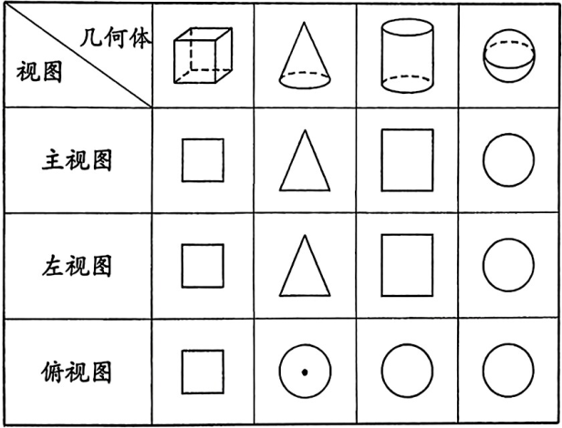
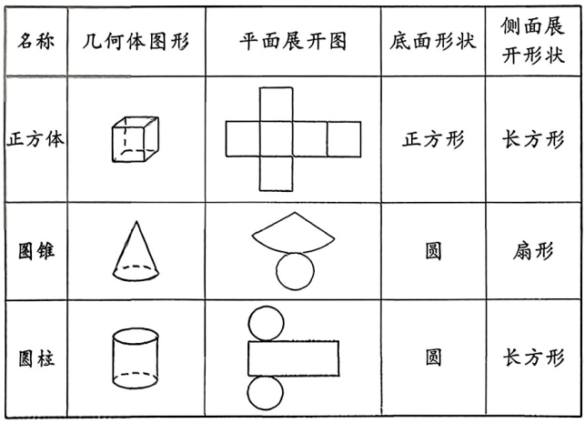
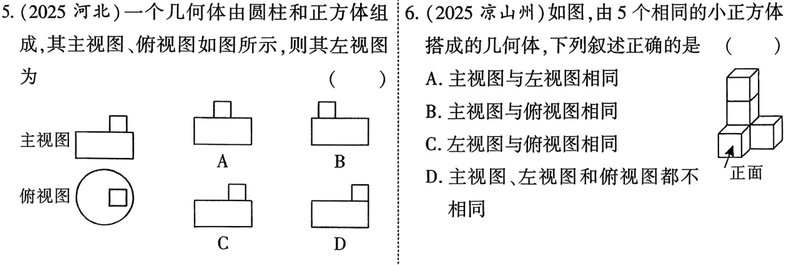
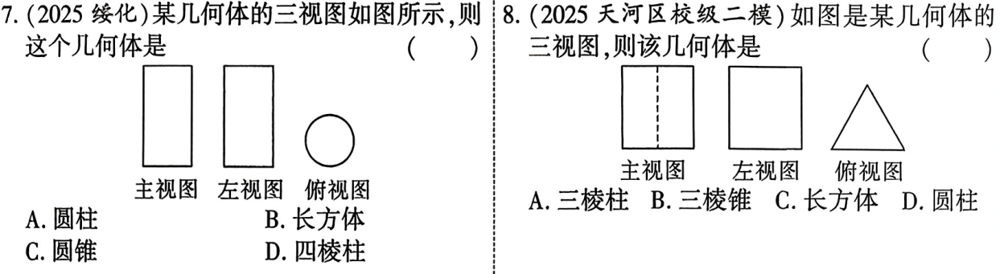
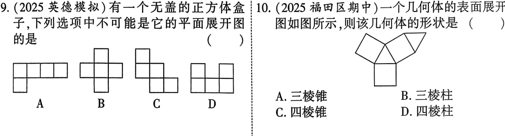
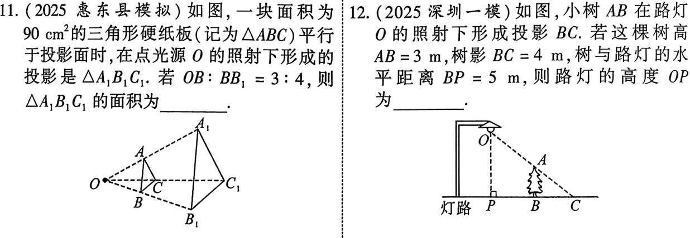
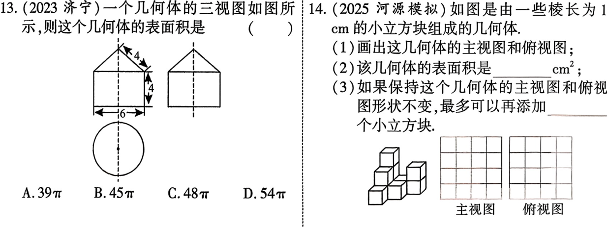
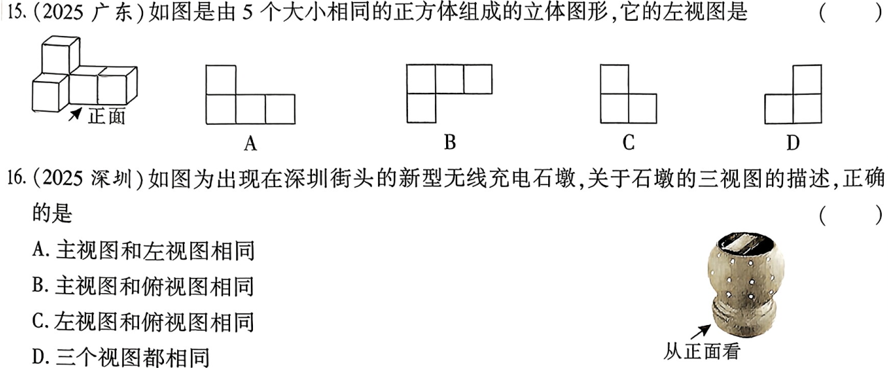
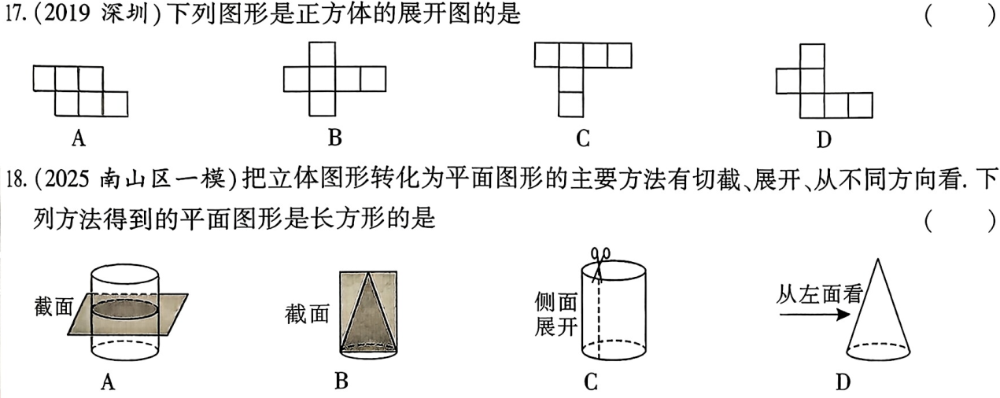

<!-- _backgroundColor: #0f172a -->
<!-- _color: white -->
<!-- _class: big -->

# 第31课 投影视图展开图
---
[下载 PPT](files/31_投影视图展开图.pptx)
## 知识点
---
### 投影
1. 投影的定义：在光线的照射下，物体在地面或其他平面上形成的影子，称为这个物体的投影
2. 平行投影：物体在平行光线下的投影
3. 中心投影：物体在某一点光源照射下的投影

---
### 三视图
1. 主视图：从正面看到的平面图形
2. 俯视图：从上往下看到的平面图形
3. 左视图：从左到右看到平面图形：

---

4. 常见的几何体的三视图：

---
### 展开图
1. 多面体是由平面图形围成的立体图形，沿着多面体的一些棱将它剪开可以把多面体展开成一个平面图形
2. 直棱柱、圆柱的侧面展开图是矩形
3. 圆锥的侧面展开图是扇形
4. 球体不能展成平面图形

---

5. 常见的几何体的展开图

---
### 命题与证明
1. 命题： 判断一件事情的语句，叫做命题。命题通常可以写成“如果...那么...”的形式，其中“如果”后接的部分是题设，“那么”后接的部分是结论。
2. 真命题与假命题：如果题设成立，那么结论一定成立，这样的命题叫做真命题；题设成立时，不能保证结论一定成立，这样的命题叫做假命题。
3. 原命题与逆命题：如果两个命题的题设、结论正好相反，那么这两个命题叫做互逆命题。
4. 反证法：
    1. 假设命题的结论不成立
    2. 从假设推论得出矛盾
    3. 由矛盾肯定命题的结论正确

---
## 考点
### 几何体的三视图

---
### 由三视图确定几何体

---
### 几何体的展开图

---

### 投影

---
### 三视图的画法及计算

---

## 考题

---

