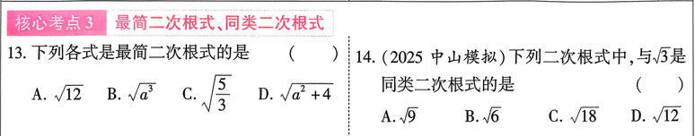

# 第三课  二次根式
## 知识点
---
### 知识点1 定义
   1. 平方根：若$x^2=a$,则x叫做a的平方根，a的平方根记作$\pm \sqrt{a}$,其中$\sqrt{a}$叫做a的算术平方根
   2. 立方根：若$x^3=a$,则x叫做a的立方根，a的立方根记作$\sqrt[3]{a}$
   3. 二次根式:形式如$\sqrt{a}(a \geq 0)$的式子叫做二次根式
   
---
### 知识点2 最简二次根式的两个条件
   1. 被开平方数所含因数是整数，因式是整式；
   2. 被开平方数中不能含有能开方的因数或因式
   
---
### 知识点3 二次根式的性质
   1. 双重非负性：$\sqrt{a} \geq 0(a \geq 0)$
   2. $(\sqrt{a})^2=a,\sqrt{a^2}=a(a \geq 0)$
   3. $\sqrt{ab}=\sqrt{a}\cdot\sqrt{b}$
   4. $\sqrt{\frac{a}{b}}=\frac{\sqrt{a}}{\sqrt{b}}(a \geq 0,b \geq 0)$
   
---
### 知识点4 二次根式的计算
   1. 加、减：化成最简二次根式，再合并同类项二次根式
   2. 乘、除：$\sqrt{a}\cdot \sqrt{b}=\sqrt{ab};\frac{\sqrt{a}}{\sqrt{b}}=\sqrt{\frac{a}{b}}$
   
## 考点
---
### 核心考点1 二次根式有意义的条件

---

### 核心考点2 平方根、立方根

---

### 核心考点3：最简二次根式、同类二次根式

---

### 核心考点4： 二次根式的性质与计算

---
## 考题

---