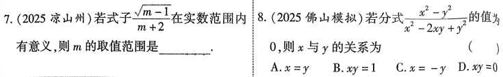
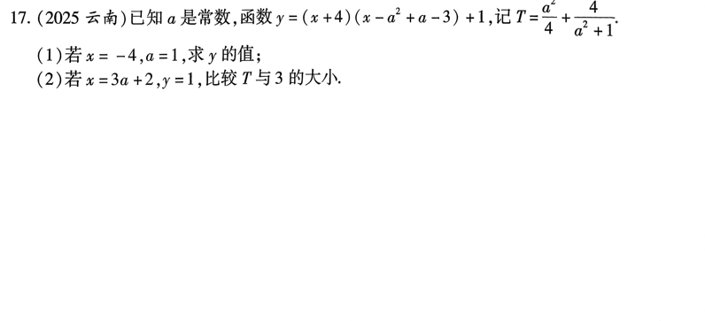

# 第4课 分式

## 知识点
---

### 知识点1
形如$\frac{A}{B}$(A,B是整式，B中含有字母，且$B \neq 0$)的式子叫做分式

---

### 知识点2 分式常用条件
   1. 分式有意义的条件: 分母不为0
   2. 分式的值为0的条件：分子为0，分母不为0
   
---

### 知识点3 分式的基本性质与运算
   1. $\frac{A}{B}=\frac{A\cdot M}{B\cdot M},\frac{A}{B}=\frac{A\div M}{B\div M}$
   2. 分式乘法：$\frac{a}{b}\cdot\frac{c}{d}=\frac{ac}{bd}$
   3. 分式除法：$\frac{a}{b} \div \frac{c}{d}=\frac{a}{b} \cdot \frac{d}{c}=\frac{ad}{bc}$
   4. 分式加法：$\frac{a}{c} \pm \frac{b}{c}=\frac{a \pm b}{c},\frac{a}{b} \pm \frac{c}{d}=\frac{ad \pm bc}{cd}$
   5. 分式减法：$(\frac{a}{b})^2=\frac{a^n}{b^n}$
   
---

### 知识点4 分式化简求值
 1. 将括号内的异分母分式通分为同分母分式，分子合并同类项，把括号去掉，简称去括号
 2. 将分式中除号($\div$)后面的除式分子分母颠掉，并把这个式子前的除号变成乘号，简称除式变乘式
 3. 计算分式乘法，将分式中的多项式因式分解再约去相同因式
 4. 最后按照式子顺序，从左到右计算分式加减法，直到化到最简为止
 5. 代数求值，代入使原分式有意义的数并计算
   
---
## 考点
### 考点1 分式有意义，分式值为0

---

### 考点2 分式的基本性质

---

### 考点3 分式的化简求值

---

## 考题

