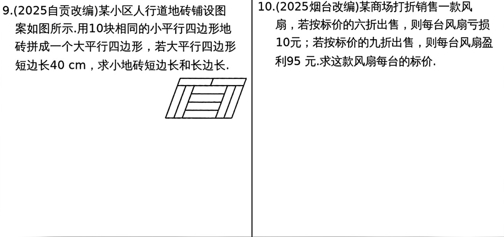

# 第5课 一次方程(组)的解法及应用
## 知识点
---

### 知识点1 等式的基本性质
    等式的左右两边同时加（减、乘、或除以）同一个代数式，结果仍为等式(注意，除数不为0)

---

### 知识点2 一元一次方程
   1. 方程：含有未知数的等式
   2. 一元一次方程：只含有一个未知数，并且未知数的次数是1的整式方程
   3. 方程的解(根)：使方程左右两边相等的未知数的值。
   4. 一元一次方程的解法步骤：
        1. 去分母
        2. 去括号
        3. 移项
        4. 合并同类项
        5. 系数化为1
   
---

### 知识点3 二元一次方程
   1. 二元一次方程：含有2个未知数，且未知数的次数都是1的整式方程
   2. 二元一次方程组的解法：
        1. 加减消元法
        2. 代入消元法
   
---

### 知识点4 列一次方程（组）解应用题
   1. $审 \rightarrow 设 \rightarrow 列 \rightarrow 解 \rightarrow 验 \rightarrow 答$
   2. 重要公式：
        1. $工作总量 = 工作效率 \times 工作时间$
        2. $路程= 速度 \times 时间$
        3. $利润=销售额 - 成本；总利润=单位利润 \times 数量$
        4. $利息=本金 \times 利润 \times 期数，本息和=利息 + 本金$
        5. $利润率=\frac{利润}{成本} \times 100%$
---
## 考点
### 考点1 解一元一次方程

---
### 考点2 解二元一次方程

---
### 考点3 一元一次方程的应用

---
### 考点4 二元一次方程组的应用
---

---
## 考题

---

