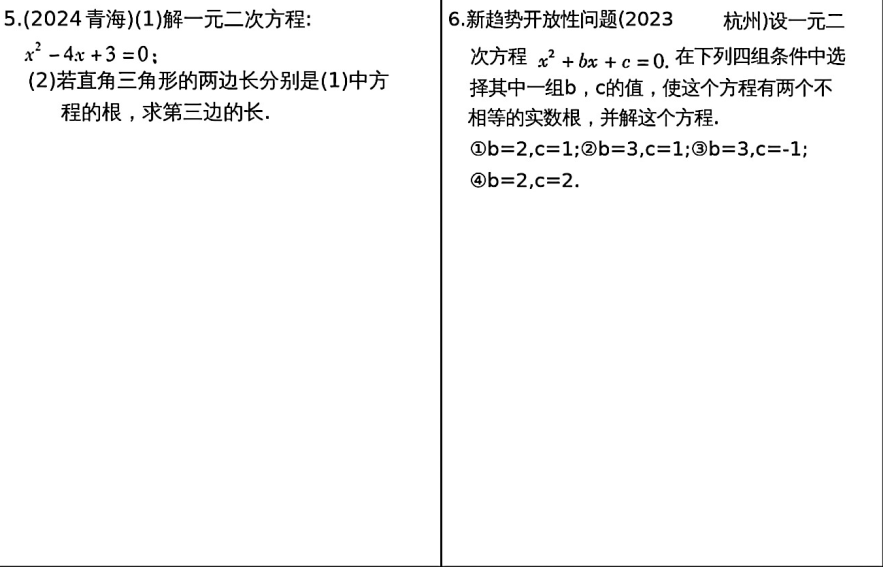
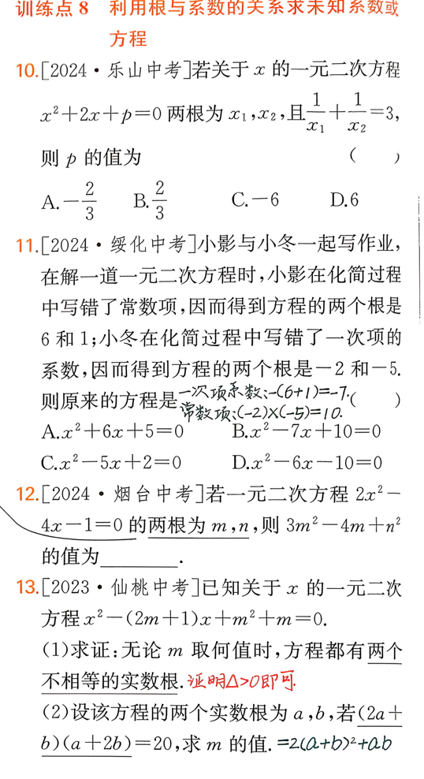
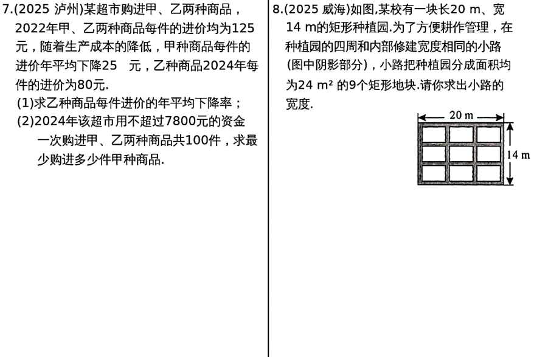
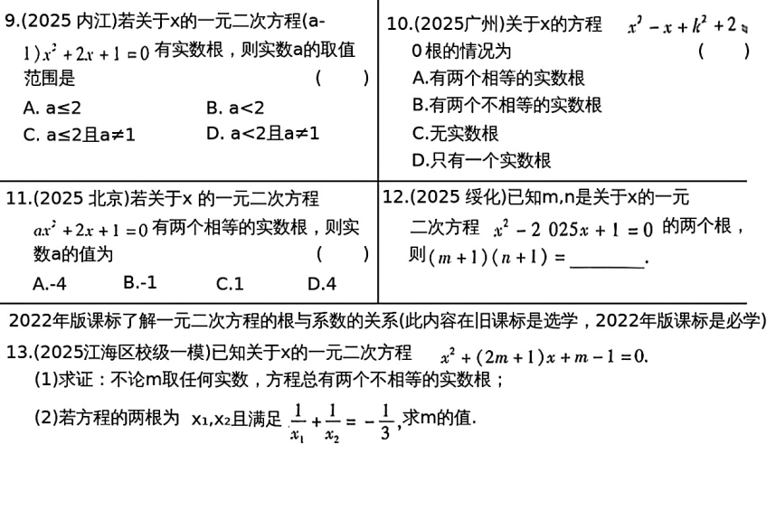
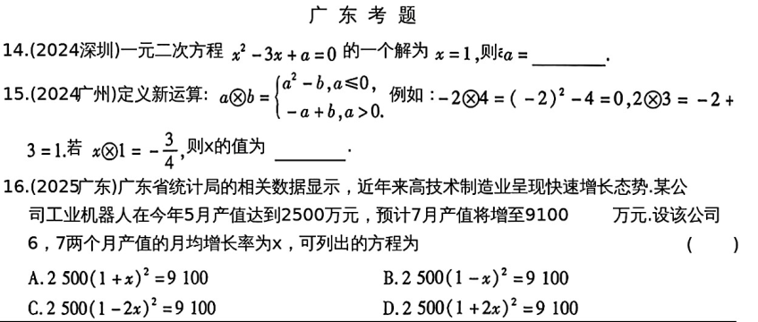
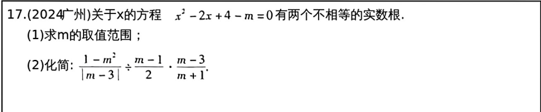

# 第6课 一元二次方程的解法及应用
## 知识点
---
### 知识点1 一元二次方程
   1. 定义： 只含有一个未知数，且未知数的最高次数是2的整式方程
   2. 判断一个方程是否一元二次方程：
        1. 判断方程是否整式方程
        2. 化简后判断只含一个未知数，未知数最高次数是2
   3. 一元二次方程的一般形式：$ax^2+bx+c=0(a \neq 0)$
      其中$ax^2$是二次项，bx是一次项，c是常数项，a是二次项系数，b是一次项系数
        

---
### 知识点2 一元二次方程的解法
   1. 降次思路：解一元二次方程的基本思路是通过“降次”把一元二次方程转化为一元一次方程求解。 
   2. 解法：
        1. 直接开平方法
        2. 因式分解法
        3. 配方法
        4. 公式法
   3. 推荐顺序: 直接开平方法，因式分解法，公式法，配方法。
   4. 一元二次方程$ax^2+bx+c=0$的求根公式：
        $x=\frac{-b\pm \sqrt{b^2-4ac}}{2a}(b^2-4ac \geq 0)$
---

### 知识点3 一元二次方程的判别式:$\Delta=b^2-4ac$
   1. $\Delta > 0 \Leftrightarrow$ 方程有两个不相等的实数根
   2. $\Delta = 0 \Leftrightarrow$ 方程有两个相等的实数根
   3. $\Delta < 0 \Leftrightarrow$ 方程无实数根
   4. $\Delta \geq 0 \Leftrightarrow$ 方程有实数根
---
### 知识点4 韦达定理
   1. 若$x_1,x_2$是关于x的一元二次方程$ax^2+bx+c=0(a \neq 0)$的根,则 $x_1+x_2=-\frac{b}{a},x_1x_2=\frac{c}{a}$.注意：韦达定理适用条件$\Delta \geq 0.$
   2. 推论：
        1. 若方程$x^2+px+q=0$的两个根是$x_1,x_2$,那么$x_1+x_2=-p,x_1x_2=q$
        2. 以两个数$x_1,x_2$为根的一元二次方程(二次项系数为1)是$x^2-(x_1+x_2)x+x_1x_2=0.$
   ---
   3. 一些常用的代数式
        1. $x_1^2+x_2^2=(x_1+x_2)^2-2x_1x_2$;
        2. $\frac{1}{x_1}+\frac{1}{x_2}=\frac{x_1+x_2}{x_1x_2}$;
        3. $(x_1+a)(x_2+a)=x_1x_2+(x_1+x_2)a+a^2$;
        4. $(x_1-x_2)^2=(x_1+x_2)^2-4x_1x_2$;
        5. $\frac{x_2}{x_1}+\frac{x_1}{x_2}=\frac{(x_1+x_2)^2-2x_1x_2}{x_1x_2}$;
        6. $|x_1-x_2|=\frac{\sqrt{b^2-4ac}}{|a|}$

 ---  

### 知识点5 一元二次方程的应用 常考类型及公式：
   1. 面积问题： $S_{矩形}=长 \times 宽 ，S_\triangle=\frac{1}{2} \times 底 \times 高$
   2. 增长率问题：$原量 \times (1+x)^n=新量$
   3. 互赠、握手问题：
        1. x人互赠总数量:$x(x-1)$
        2. x人两两握手总次数:$\frac{1}{2}x(x-1)$
   4. 营销问题：$总利润=单位利润 \times 销售量$
---

## 考点
### 考点1 解一元二次方程

---

---

---

### 考点2 一元二次方程的应用（增长率问题，面积问题，销售问题，互赠握手问题）

---
### 考点3 韦达定理与根的判别式

---
## 考题

---