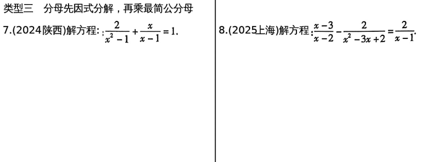
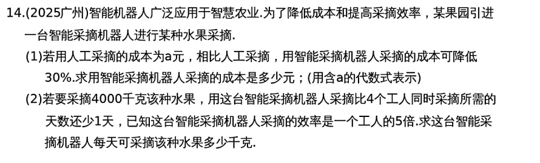

# 第7课 分式方程的解法及应用
---
## 知识点
### 知识点1 分式方程
   1. 定义：分母含有未知数的有理方程叫做分式方程
   2. 解法：
        1. 去分母(方程两边同时乘最简公分母)化为整式方程；
        2. 解这个整式方程
        3. 检验（将所得的解代入最简公分母，若为0，则不是原分式方程的解，若不为0，则是原分式方程的解）

---
### 知识点2 分式方程的应用
   1. 解分式方程应用题的步骤：审、设、列、解、检、答
   2. 常考类型及数量关系：
        1. 工程问题：$工作时间=\frac{工作总量}{工作效率}$
        2. 行程问题：$时间=\frac{路程}{速度}$
        3. 销售问题：$数量=\frac{总价}{单价}$
---
## 考点
### 考点1 解分式方程
   1. 在去分母时，每个式子都要乘最简公分母，常数项不要漏乘
   2. 解分式方程时必须检验。

---

---

---

---
### 考点2 分式方程的应用

---

## 考题

---

---