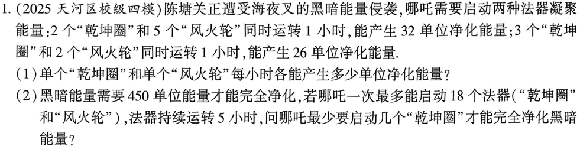
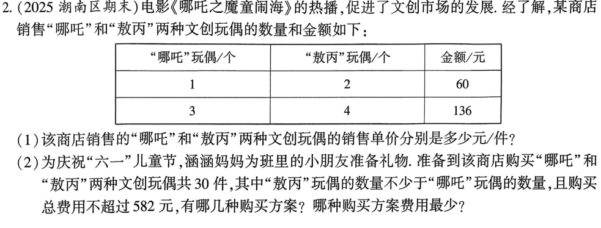
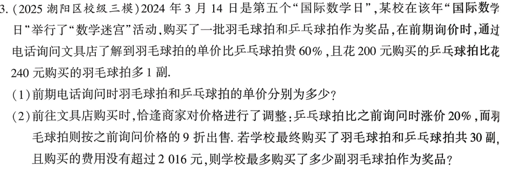
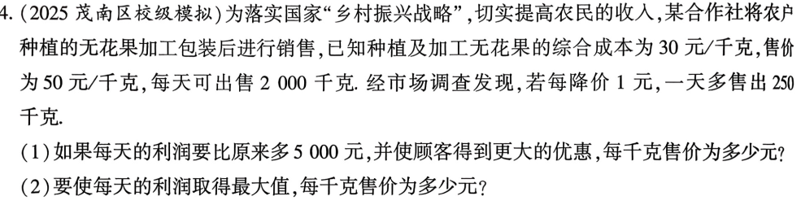

<!-- _backgroundColor: #0f172a -->
<!-- _color: white -->
<!-- _class: big -->

# 第1课 方程不等式的实际应用
---
[下载 PPT](files/1_方程不等式的实际应用.pptx)

---
## 二次一次方程组与一元一次不等式的应用

---
## 不等式组的应用

---
## 列分式方程解应用题

---
## 列一元二次方程解应用题

---