<!-- _backgroundColor: white -->
<!-- _color: black -->
<!-- _class: big -->
<!-- _fontSize: 80px -->

# 第6课 二次函数压轴题拆解

---
[下载 PPT](files/6_二次函数压轴题拆解.pptx)

---
## 与线段有关

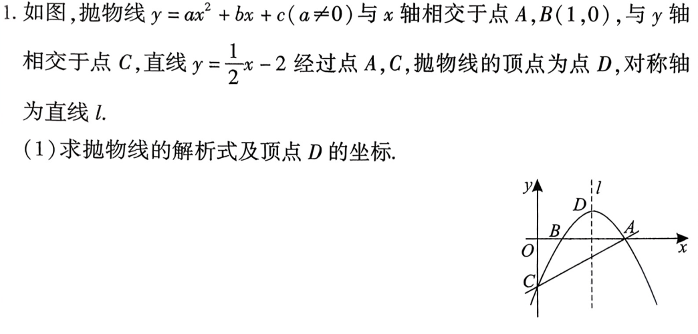

---
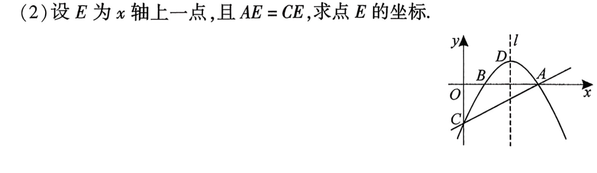

---
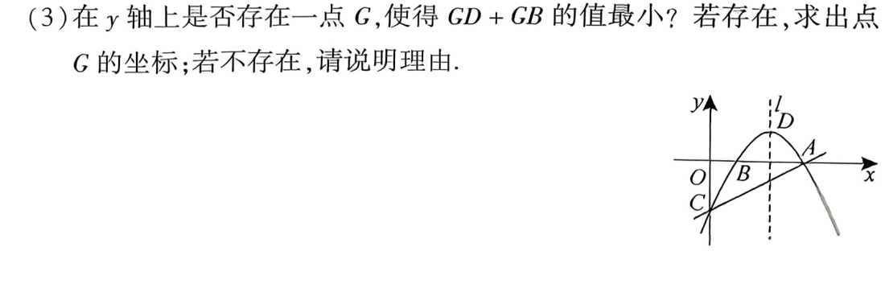

---
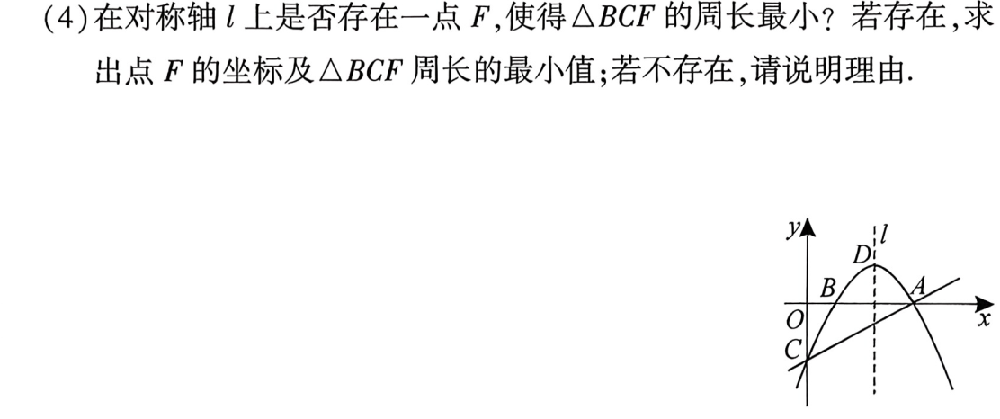

---

## 与面积有关
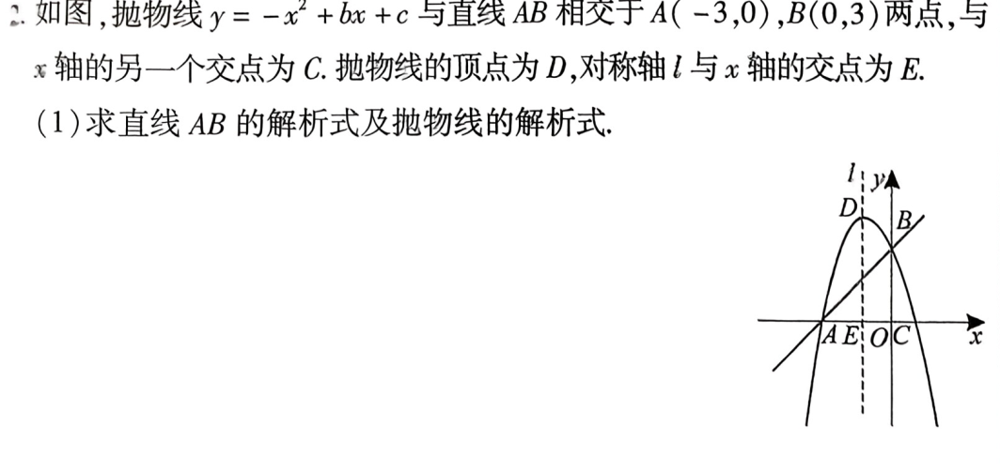

---
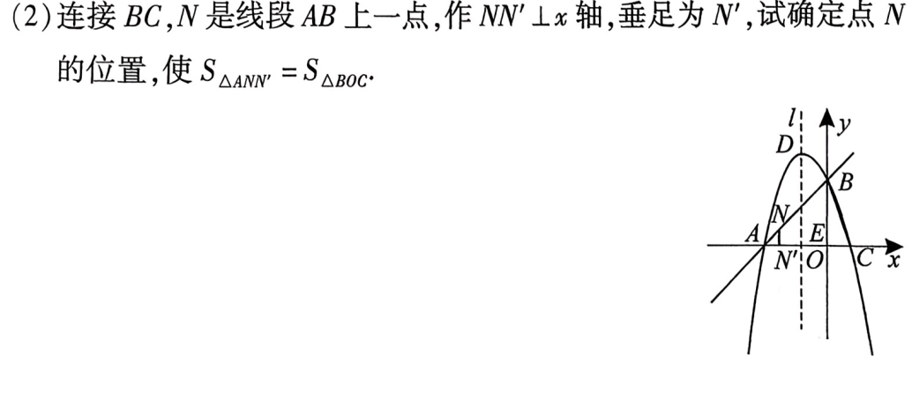

---
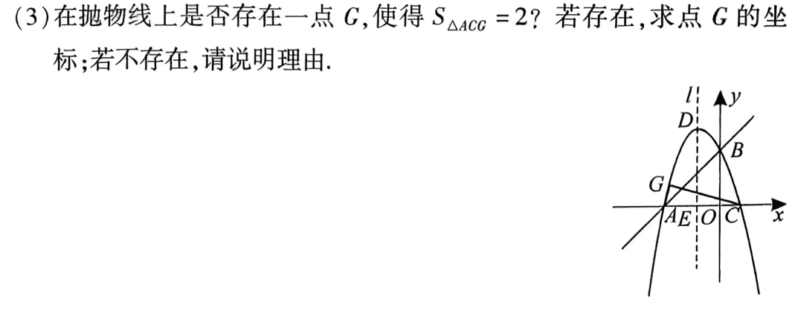

---
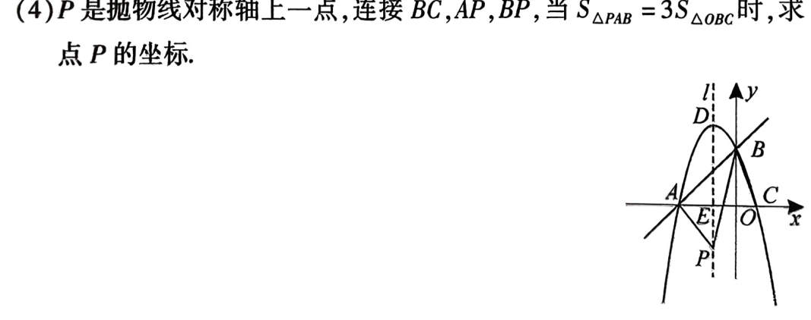

---

## 与特殊三角形有关
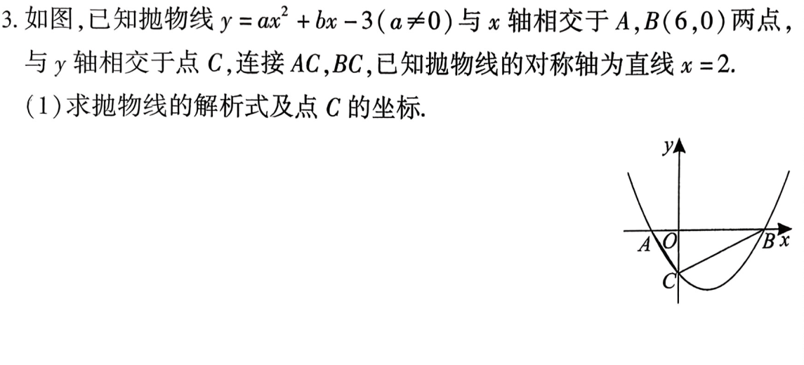

---
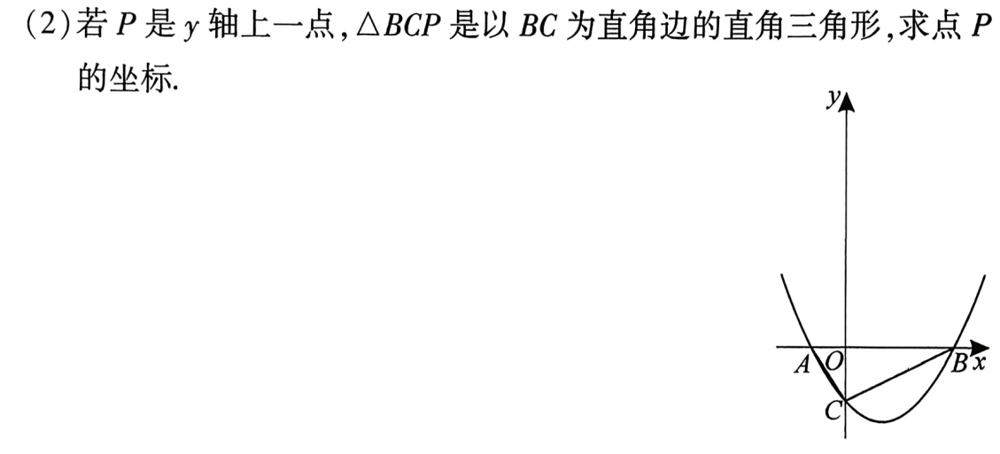

---
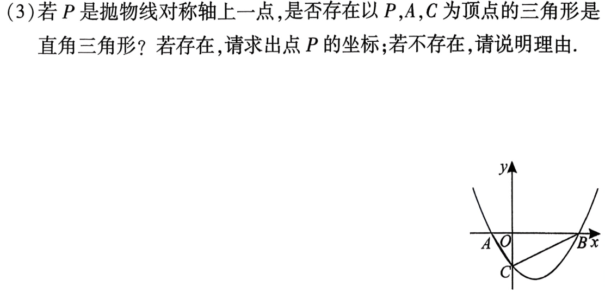

---
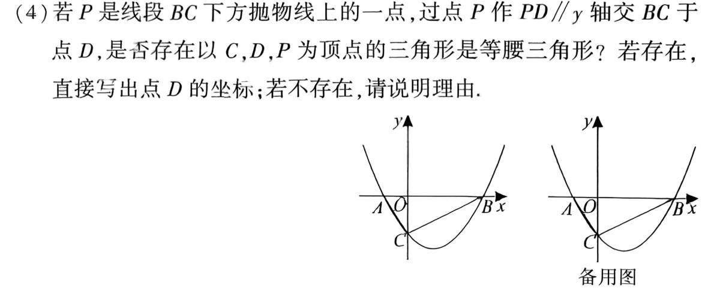

---

## 与特殊四边形有关

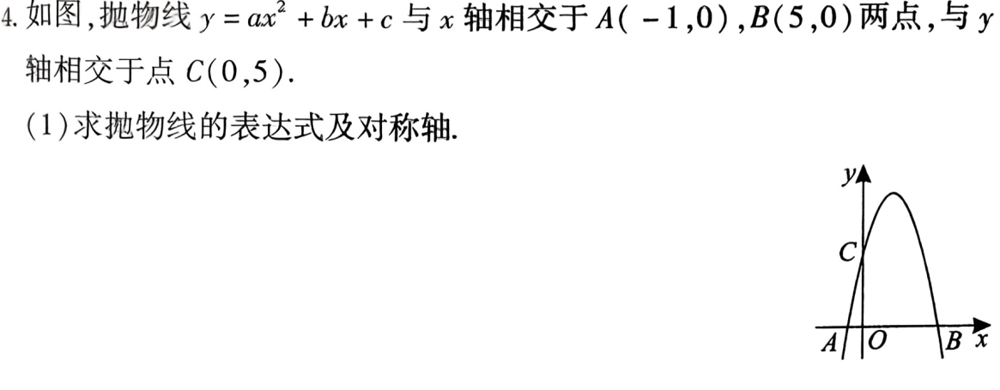

---

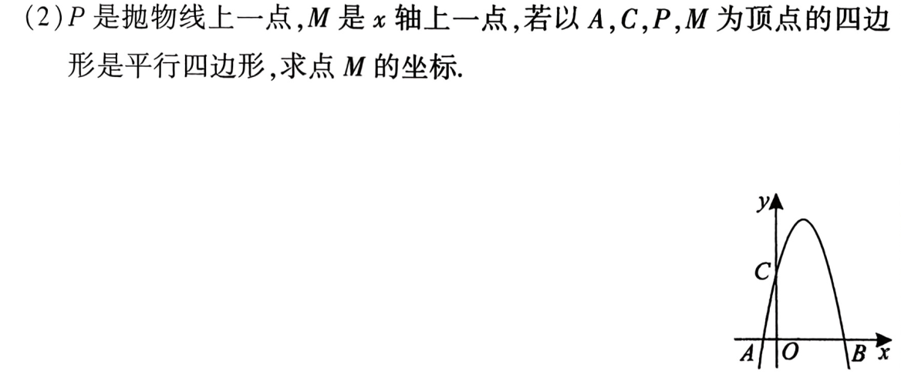

---

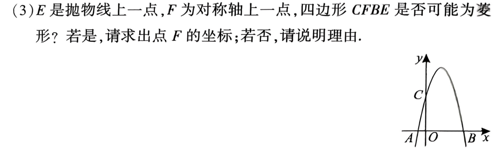

---
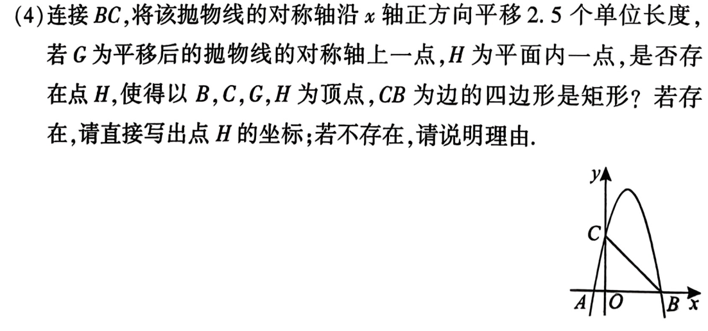

## 中考实战

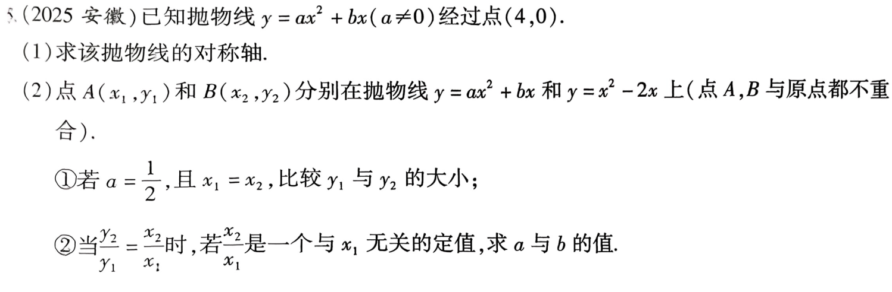

---

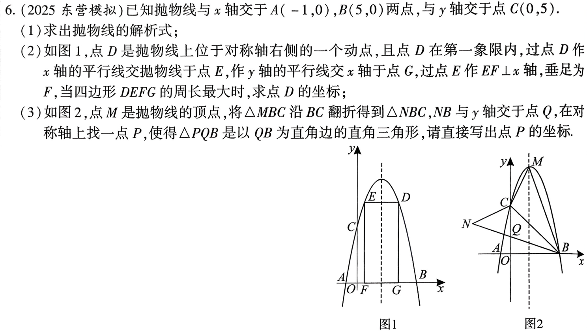

---

