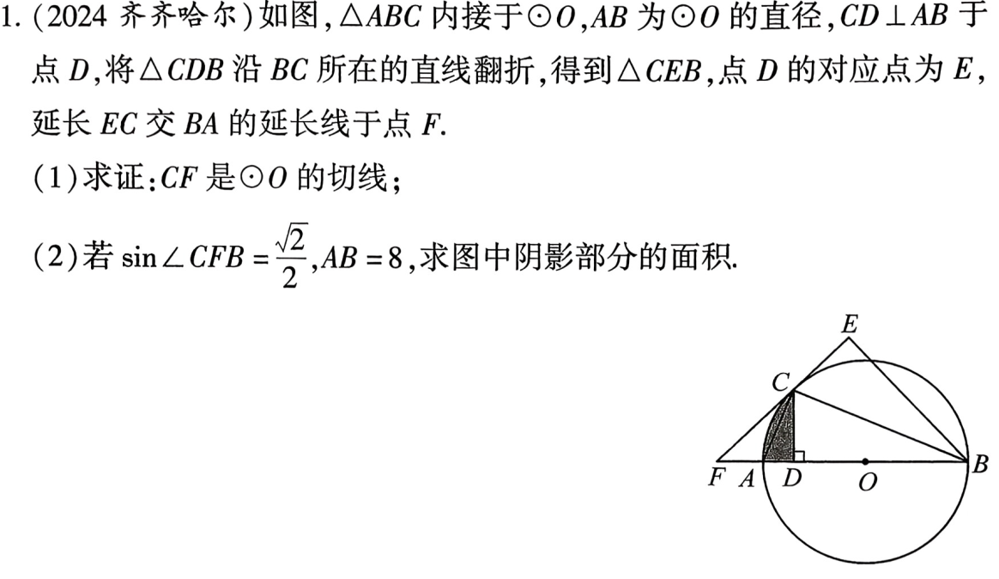
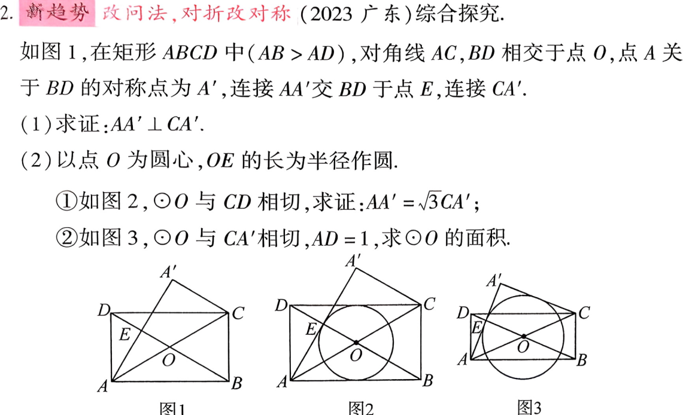
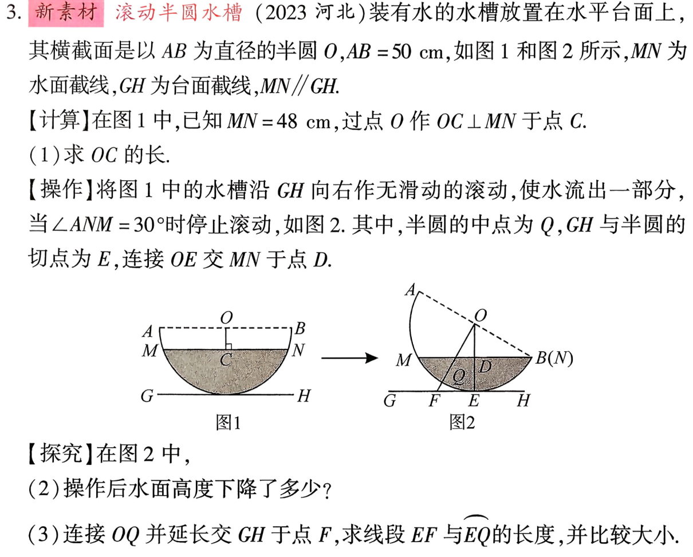
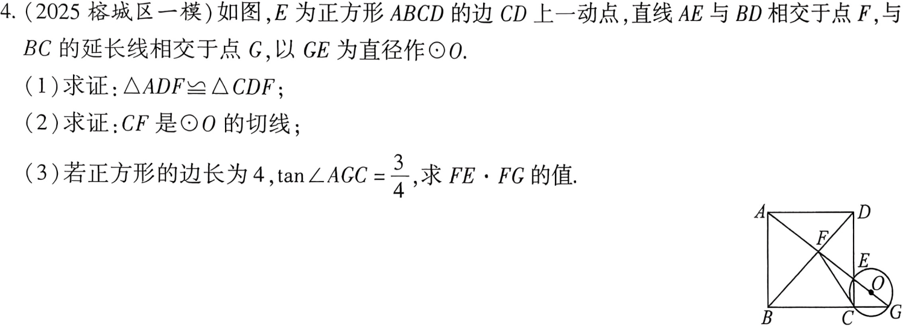

<!-- _backgroundColor: white -->
<!-- _color: black -->
<!-- _class: big -->
<!-- _fontSize: 80px -->

# 第7课 圆
圆的考法：考察切线的判定与性质，全等与相似，勾股定理，锐角三角函数等，也常与特殊四边形组合考察几何变换(翻折，旋转，平移等)
---
[下载 PPT](files/7_圆.pptx)

---

---
## 结合特殊四边形

---

## 水槽截面

---

## 圆与正方形

