<!-- _backgroundColor: white -->
<!-- _color: black -->
<!-- _class: big -->
<!-- _fontSize: 80px -->

# 第8课 几何变换
---
[下载 PPT](files/8_几何变换.pptx)

---
## 一、折叠（轴对称）问题
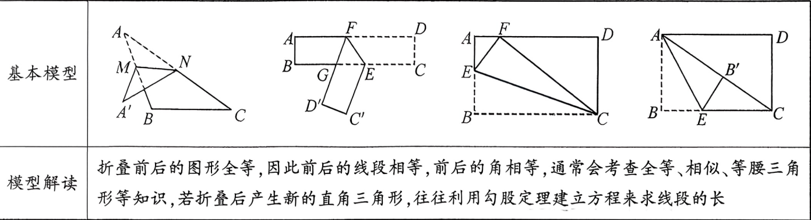

---
### 1.三角形折叠
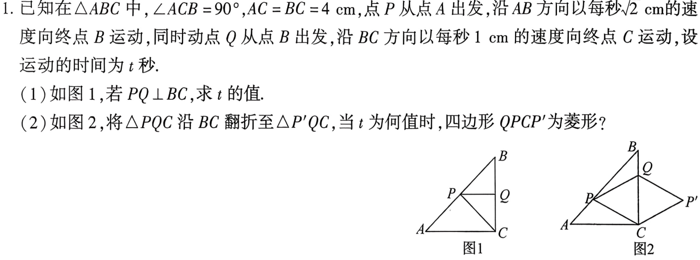

---

### 平行四边形、菱形
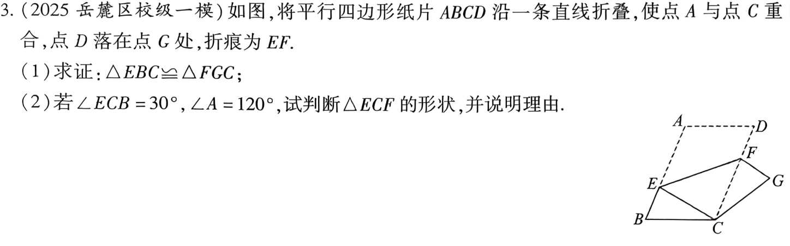

---

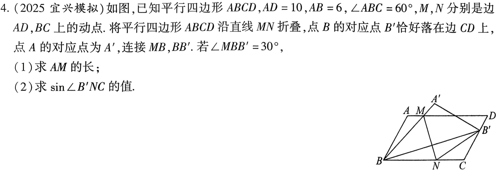

---

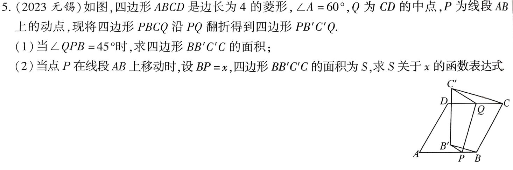

---
### 矩形折叠

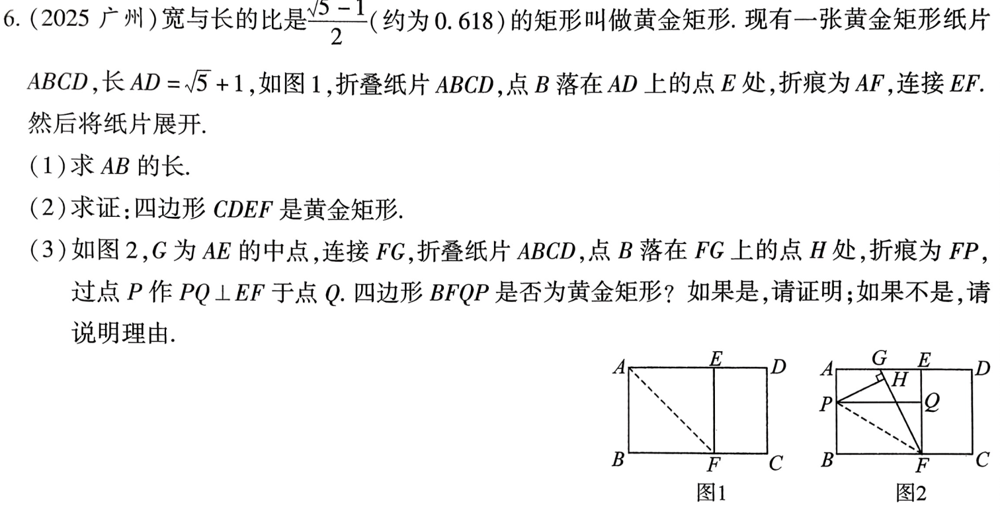

---
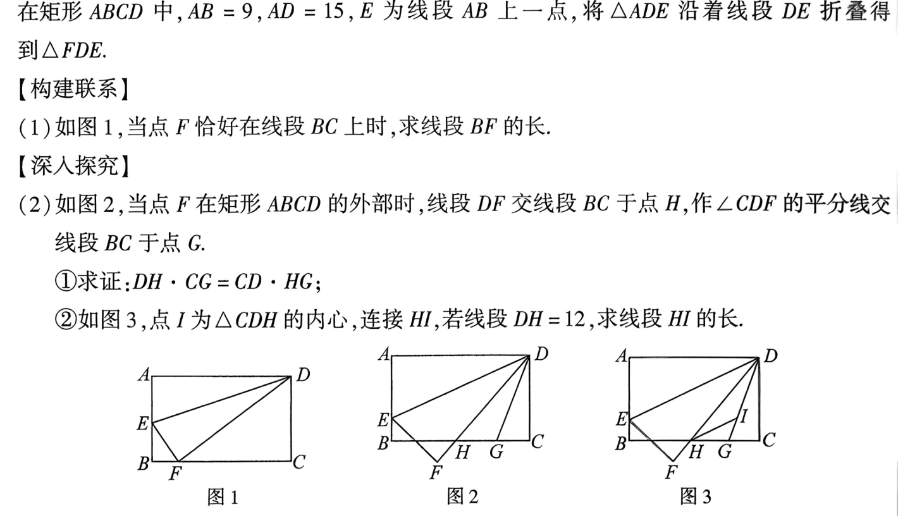

---

## 旋转
### 旋转与等边三角形
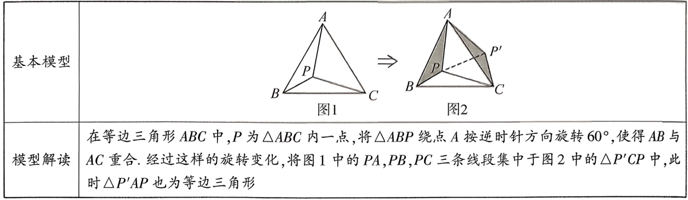

---
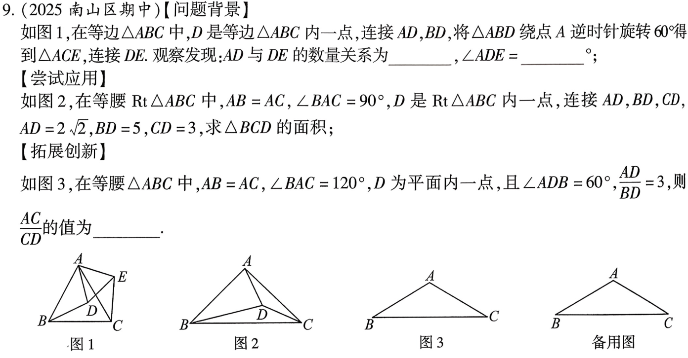

---

### 旋转与等腰直角三角形

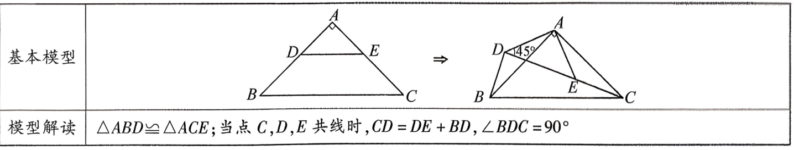

---
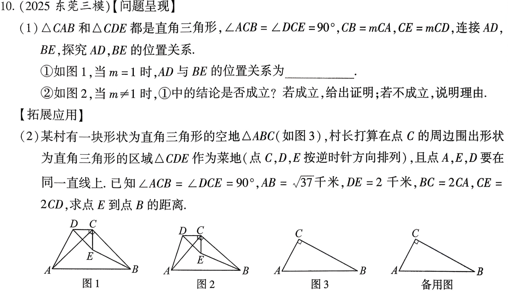

---
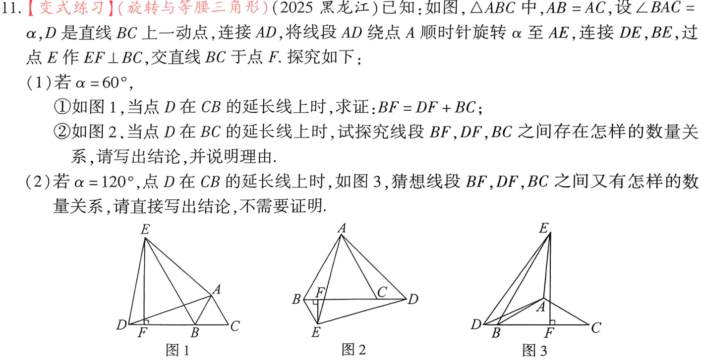

---
### 旋转与矩形、菱形

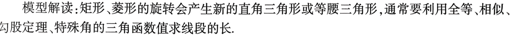

---
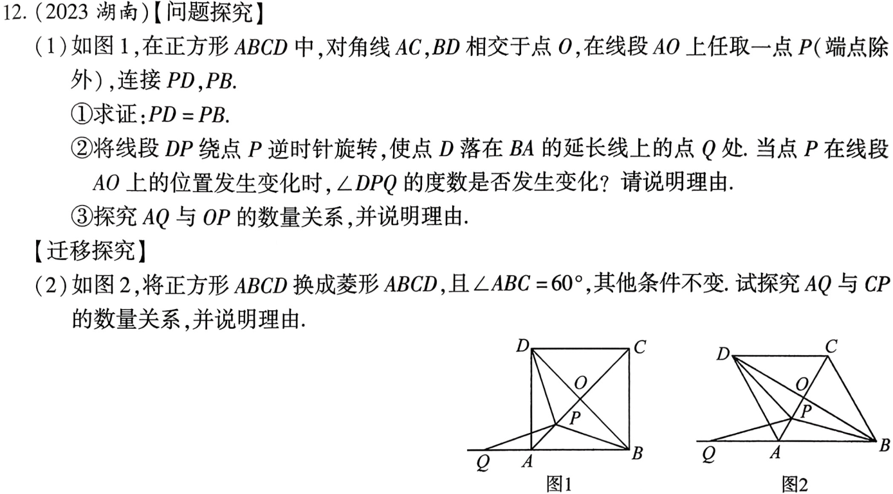

---
### 旋转与正方形(半角模型)
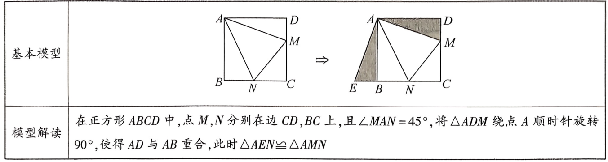

---
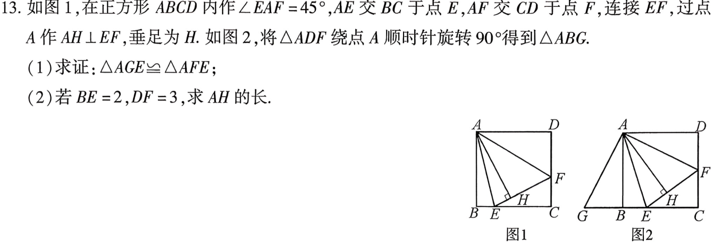

---
